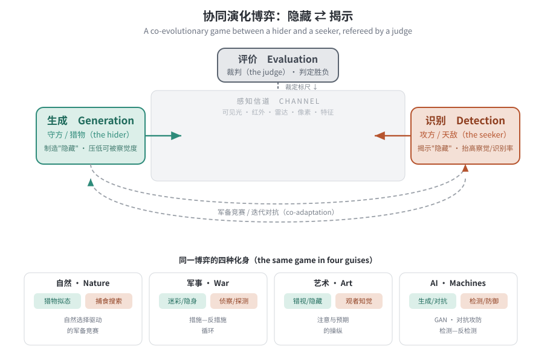

::: {.callout-tip}
## 本章导读
伪装看似是生物学、军事学、艺术与人工智能各自的话题，本章要回答一个更基本的问题：**它们说的是不是同一件事？** 我们从一幕跨越四个领域的"同题异构"开始（1.1），盘点现有著作的版图与空白、阐明本书的立足点（1.2），随后厘清"伪装"周边一族纠缠的术语（1.3），给出一套不依赖具体载体、可跨领域复用的分类学（1.4），把它放进"物理—数字—智能"三域框架（1.5），再立起贯穿全书的主线——**协同演化博弈**（1.6）；最后交代本书的范围边界与编纂方法（1.7）、体例与阅读路径（1.8），并用一个最小可运行的例子把这场博弈"跑"起来（1.9）。读完本章，后续每一章你都能精确定位它在这场"隐藏 ⇄ 揭示"博弈中的坐标。
:::

## 1.1 引论：四张面孔，同一个问题 {#sec-01-intro}

请同时想象四个画面。

一只枯叶蝶停在落叶层上，翅膀的脉络、斑驳与残缺都酷似一片真正的枯叶；捕食的鸟掠过，没有停留。一艘一战的运兵船被漆上夸张刺眼的黑白色块，它非但不隐蔽，反而醒目，却让远处潜艇的瞄准手算不准它的航速与航向，鱼雷扑空。一幅欧普艺术（Op Art）的画作让观者的眼睛无法"锁定"形状，图形在视网膜上游移、抖动、难以辨认。一张贴在路牌上的、看似随机花纹的小贴纸，让自动驾驶汽车的检测网络把"停"看成了"限速 45"。

四张面孔——生物、军事、艺术、机器——表面毫不相干，背后却是同一个问题：**如何让某个东西不被"看见"，或虽被看见却不被"认出"？** 以及它的对偶问题：**如何揭穿这种隐藏？** 本书的全部内容，都是这一对孪生问题在不同载体上的展开。

更进一步，这一对问题从来不是静态的。枯叶蝶的拟态，是被无数代捕食者的"挑剔"筛选出来的；潜艇瞄准术的进步，逼出了更巧的舰船涂装；检测网络越强，对抗贴纸就越精巧。隐藏方与揭示方彼此为对手、互相塑造——这是一场**协同演化的博弈**。把这场博弈讲清楚，并证明它在四个领域里是**同一个结构**，是本章、也是全书的纲。

本书因此把伪装拆成三个支柱来组织：**生成**（如何制造隐藏，守方/猎物之事）、**识别**（如何揭穿隐藏，攻方/天敌之事）、**评价**（如何裁定这场博弈的胜负，裁判之事）。三支柱、三技术域（物理/数字/智能）、三学科视角（自然/军事/人文艺术）交织成本书的经纬——而那条把它们缝合为一个整体、而非并列拼盘的线，正是协同演化博弈。

## 1.2 现有著作的版图与空白 {#sec-landscape}

伪装并非无人书写，恰恰相反——它在每个领域都有传世之作。问题在于这些著作彼此**割裂**，且 AI 一侧的资源几乎只谈"检测"或只谈"攻击"。理解这一版图，才能看清本书的立足点。

在**生物学**一侧，Cott 1940 年的《Adaptive Coloration in Animals》是奠基之作，把动物体色的适应性功能系统地归为隐蔽、伪饰与广告三类，至今仍被频繁引用[@cott1940]；它的思想源头可上溯到 Poulton 对动物色彩"意义与用途"的早期分类[@poulton1890]、Thayer 对消影与隐蔽色的开创（与过度推广）[@thayer1909]、乃至 Wallace 对保护色的进化论阐释[@wallace1889]。现代则有 Stevens 与 Merilaita 主编的《Animal Camouflage: Mechanisms and Function》[@stevens2011]、Ruxton 等的《Avoiding Attack》[@ruxton2018] 与 Cuthill 的机制综述[@cuthill2019]，把机制与功能讲得精细而严谨。但它们都止步于生物学，不涉计算技术。

在**艺术与文化**一侧，Behrens 的《False Colors》《Camoupedia》《Ship Shape》以艺术史家的眼光，记录了一战二战中艺术家充当"伪装师（camoufleurs）"的传奇，并把格式塔心理学作为理解伪装设计的钥匙[@behrens2002; @behrens2009book]。但其叙事多止于二战，几乎不触及数字迷彩之后的发展，更无计算技术。

在**军事**一侧，Newark、Hartcup 记录了伪装的战争史与图案史[@newark2007; @hartcup1979]，Blechman 的《DPM》以近千页、五千余幅图、逾百国图案，编成一部迷彩百科[@blechman2004]；近年还有基于计算机视觉纹理分析、揭示迷彩"文化演化"的研究[@talas2017military]。但这些以图录与史学为主，鲜及识别与评价，更无 AI。

在**计算机视觉/AI**一侧，资源最新、也最碎。伪装目标检测（COD）有 2024 年的系统综述[@xiao2024survey]，对抗攻击有 TPAMI 的十年综述[@wei2024decade] 与 ACM Computing Surveys 的物理世界攻防综述[@csur2026physical]，NIST 还发布了对抗机器学习的术语标准[@nist2023aml]。但它们要么只谈"检测"，要么只谈"攻击"，且与生物、军事、艺术彼此不通。

把这张版图列成 @tbl-positioning，结论一目了然：**没有任何一本书同时跨越四个领域，也没有任何一本同时覆盖生成、识别、评价三支柱。** 现有著作各自深耕一隅，缺少缝合彼此的统一框架；AI 资源多为一次性的静态综述，缺少可运行、可复现、可持续更新的"活"平台。

| 代表著作 / 资源 | 领域 | 覆盖支柱 | 形态 | 本书补足的空白 |
|------|------|----------|------|----------------|
| Cott 1940；Stevens & Merilaita 2011；Ruxton 2018 | 生物 | 偏机制 | 专著 | 不含计算技术域 |
| Behrens《False Colors》《Camoupedia》 | 艺术/军事 | 史与设计 | 专著 | 止于二战；无 AI、无评价 |
| Newark；Hartcup；Blechman《DPM》 | 军事 | 图案/史 | 图录/百科 | 无识别/评价、无 AI |
| 《A Survey of COD and Beyond》2024 | AI | 仅识别 | 综述（静态） | 无生成/评价/跨域；不可运行 |
| 物理对抗攻击十年综述 2024 | AI | 仅生成（攻击） | 综述（静态） | 不与生物/军事缝合；无统一评价 |
| **本书 CamoGED** | **四领域** | **生成+识别+评价** | **活专著+平台** | —— |

: 现有著作的版图与本书的定位 {#tbl-positioning}

本书的"**人无我有**"由此而来：跨四领域、覆盖全三支柱、以一条博弈主线缝合、并辅以可运行的工具包与原创方法。"**人有我新**"则在于：补齐 Behrens 止步的二战之后（数字迷彩、对抗迷彩、AIGC 生成、基础模型检测），并把"评价"从综述里的边角提升为独立的一篇。

## 1.3 一族纠缠的术语：从隐蔽到欺骗 {#sec-terms}

谈论伪装的第一重困难，是术语。日常语言里"伪装""隐身""拟态""欺骗"几乎混用，但在科学语境中它们指向不同的机制与目的。把它们厘清，是建立统一框架的前提。

"伪装"一词（camouflage）本身来自法语 *camoufler*（意为"乔装、遮掩"），在一战中随法军的伪装实践进入英语并迅速通行——这本身就是军事与语言交织的一个注脚。但作为科学概念，最早、也最系统的划分来自生物学。Cott 把动物体色的适应性功能归为三大类：**隐蔽（concealment）**、**伪饰（disguise）** 与 **广告（advertisement）**[@cott1940]。前两类指向"不被发现或不被认出"，第三类（如警戒色 aposematism）反其道而行之，主动"被看见"以示警。本书聚焦前两类——也就是广义的伪装。

现代综述进一步把"不被发现"与"不被认出"区分为两个层次[@stevens2011; @cuthill2019]，这一区分可借**信号检测**的语言来理解，是贯穿全书的关键轴线：

- **隐蔽（crypsis）**：阻止观察者**察觉（detection）** 到目标的存在。背景匹配、瓦解色、消影、透明与镀银（大洋鱼类的银膜）等都服务于此。
- **伪装性拟态（masquerade）**：目标被察觉了，却被**误认（misclassification）** 为环境中无关紧要之物（一根枯枝、一片落叶、一摊鸟粪），从而阻止**识别（recognition）**。

把"察觉"放进**信号检测论（signal detection theory）** 的语言，能让这一层次更精确，也为第四篇的评价埋下伏笔。任何揭示方都面临一个在噪声（背景）中判断"信号（目标）是否存在"的决策：它可能**命中（hit）**、**虚警（false alarm）**、**漏报（miss）** 或**正确否定**。伪装的作用，是压低目标信号相对背景噪声的"可分性"（可理解为降低判别灵敏度 $d'$），从而把揭示方推向更多的漏报。这一视角的好处是：它把"伪装好不好"从主观印象，变成可由**命中率—虚警率曲线（ROC）** 度量的客观问题——这正是第 15 章评价识别质量的理论根基，也解释了为何单看一张图"像不像"远不足以判定伪装是否成功。

"察觉 vs 识别"的二分意味着伪装的失败有两种——被发现，或被认出；成功的伪装至少要在其中一环取胜。它在计算机视觉里有直接对应：伪装目标检测既要把目标从背景中**分割出来**（对抗察觉），又要正确**判定其类别/实例**（对抗识别）。本书第 11–13 章正沿这条轴线展开。

与伪装相邻、却需要分清的还有几个概念：

- **拟态（mimicry）** 在生物学中常指一个物种在信号上模仿另一物种。它有若干子型：无毒物种模仿有毒物种以避敌的**贝氏拟态**（Bates 在亚马逊蝴蝶中首次系统描述[@bates1862]）、多个有毒物种互相趋同以分摊"教育捕食者"成本的**缪氏拟态**、以及捕食者模仿无害对象以接近猎物的**攻击性拟态**。拟态既可服务于隐蔽，也可服务于警告或诱捕，因此与伪装**部分重叠而不等同**。
- **欺骗（deception）** 是更上位的范畴：操纵接收者的感知或信念。伪装是欺骗的一个子集；军事中的假目标、佯动，魔术师的误导，乃至本书后文的"对抗样本"，都属于欺骗，却未必是"隐蔽"。
- **隐身 / 低可探测（stealth / low-observable）** 是工程与军事对"隐蔽"的再表述，强调跨多个**感知信道**（可见光、红外、雷达、声）压低目标的"信号特征（signature）"。

这些术语的关系可由 @tbl-terms 概览。厘清它们不是文字游戏：它决定了一种伪装"骗"的是感知流水线的哪一环，也决定了揭示方需要用何种手段去破解。

| 术语 | 英文 | 目的 | 攻防角色 | 典型实例 |
|------|------|------|----------|----------|
| 隐蔽 | crypsis / concealment | 阻止**察觉** | 守方 | 背景匹配、瓦解色、消影、透明 |
| 伪装性拟态 | masquerade | 阻止**识别**（被误认） | 守方 | 枯叶蝶、竹节虫、拟鸟粪毛虫 |
| 伪装（广义） | camouflage | crypsis + masquerade | 守方 | 迷彩、隐藏目标 |
| 信号拟态 | mimicry | 模仿他者信号 | 守方/信号方 | 贝氏/缪氏/攻击性拟态 |
| 欺骗 | deception | 操纵感知/信念 | 守方 | 假目标、佯动、对抗样本 |
| 隐身 | stealth / low-observable | 跨信道压低特征 | 守方 | 雷达吸波、红外抑制 |
| 揭示 | detection / recognition | 察觉并认出目标 | 攻方 | 侦察、显著性、COD 模型 |

: 伪装相关术语谱系（中英对照与攻防定位） {#tbl-terms}

::: {.callout-note}
## 一处历史争议：Thayer 的消影定律
"消影"（countershading，背深腹浅以抵消立体阴影）常被称作"Thayer 定律"，源自画家 Abbott Thayer 的开创观察[@thayer1909; @behrens2002]。但 Thayer 后来把它推广到几乎所有动物体色——甚至认为火烈鸟的粉红是为了融入晚霞——招致 Theodore Roosevelt 等人的激烈反驳。本书采用现代实验生态学的审慎立场：消影是**多种**伪装机制之一，其效力依背景、光照与观察者而异，而非万能解释[@cuthill2019]。这一争议本身极具启发：关于伪装"是否有效"的论断，不能靠直觉或权威，必须交给可重复的**评价**（见第四篇）——这正是本书把评价立为独立一篇的远因。
:::

## 1.4 一套可跨域复用的分类学 {#sec-01-taxonomy}

要让生物学的洞见能迁移到军事与 AI，我们需要一套**不依赖具体载体**的分类学。本书沿三条正交的轴来组织伪装。

**轴一　对抗哪一环：察觉 vs 识别。** 如 @sec-terms 所述，隐蔽攻击"察觉"，拟态攻击"识别"。这条轴决定了一种伪装的"作用点"，也决定了破解它所需的算法层次：阻止察觉的伪装，要用分割/显著性去破；阻止识别的伪装，要用语义/开放词汇去破。

**轴二　机制谱系。** 综合生物学文献[@cott1940; @stevens2011; @ruxton2018]，隐蔽的核心机制可归纳为六类：

1. **背景匹配（background matching）**：颜色、纹理、亮度统计逼近背景；
2. **瓦解色（disruptive coloration）**：高对比色块切断目标轮廓，破坏"完形"；
3. **消影 / 自阴影抑制（countershading）**：抵消由光照产生的立体线索；
4. **伪装性拟态（masquerade）**：整体伪装为无关物体；
5. **干扰性标记（distractive markings）**：吸引注意离开可暴露轮廓的部位；
6. **运动相关伪装（motion-related camouflage）**：处理"运动必然暴露"这一难题——或抑制运动线索（运动隐蔽），或以高对比图案干扰对速度与航向的判断（运动眩惑 / motion dazzle）。

值得强调的是，**瓦解色与"眩惑"恰是伪装中最反直觉、也最具跨域穿透力的一类**：它们并不让目标"消失"，反而可能更显眼，却通过破坏轮廓或扰乱运动估计而降低被命中/被识别的概率。一战船舶的眩惑迷彩（dazzle）正是此理——它无意隐藏军舰，而要让潜艇难以估算其航速与航向[@behrens2002; @behrens2009book]。这一思想在第 6 章的"物理对抗迷彩"中以全新形态复活：对抗扰动同样无须让目标"消失"，只需把检测器的判断推过决策边界。

这六类机制并非生物学的专利。它们几乎都能在计算视觉中找到精确的对应物——这正是本书反复强调的"跨域同构"。@tbl-mech 把每一种机制、它的生物范例、以及它在揭示方（检测器）一侧引出的算法对策并置，作为后续各章的索引。

| 机制 | 生物范例 | 攻击的是什么 | 揭示方的算法对策（见后续章） |
|------|----------|--------------|------------------------------|
| 背景匹配 | 比目鱼、变色龙、头足类 | 颜色/纹理统计 | 频域分析、纹理对比、显著性（第11章） |
| 瓦解色 | 多种蛙、蛇的斑块 | 轮廓"完形" | 边界/边缘线索建模（第11章） |
| 消影 | 多数有蹄类、鲨鱼 | 立体阴影线索 | 光照归一化、形状先验 |
| 伪装性拟态 | 枯叶蝶、竹节虫、叶尾壁虎 | 类别识别 | 语义分割、开放词汇识别（第13–14章） |
| 干扰性标记 | 部分蝶蛾的亮斑/斑点 | 注意分配 | 注意机制、去分心建模 |
| 运动伪装/眩惑 | 运动眩惑的动物；dazzle 船舶 | 运动/速度估计 | 光流、时序一致性建模（第12章） |

: 伪装机制 × 生物范例 × 揭示方算法对策（跨域同构索引） {#tbl-mech}

这张表本身就是一个论点：**生物用上亿年进化出的隐藏手段，与机器视觉用来揭示它们的算法，是同一枚硬币的两面。** 守方每多一种机制，攻方就需多一类对策；反之亦然——这正是 1.6 节"军备竞赛"的微观写照。

**轴三　主动 vs 被动。** 被动伪装是固定的（一身迷彩服、一张静态纹理）；主动伪装随环境实时改变（头足类的变色、电致变色材料、可学习的生成器）。这并非二元，而是一个连续谱：主动性越强，守方越接近一个能"应对揭示方"的智能体——这把我们自然引向博弈视角。GAN 的生成器、对抗攻击的优化过程，都是这条谱的极端——一个会针对当前揭示方持续调整自己的守方。

这三轴并非孤立。把它们与"守方/攻方"的角色叠加，就得到一张可填入任意领域实例的**标定网格**：任何一项伪装技术，都可被标定为"〔主动/被动地〕以〔某机制〕对抗〔察觉/识别〕，作用于〔某信道〕"。本书后续介绍的每一种方法，原则上都能在这张网格上找到唯一坐标——这正是"跨域可复用"的含义。

### 1.4.1 机制不是标签，而是失败模式

把伪装机制列成清单只是第一步。更重要的是反过来理解：每一种机制都对应揭示方的一类**失败模式**。背景匹配让揭示方在低层统计上失败，因为目标与背景的颜色、亮度、纹理分布过于接近；瓦解色让揭示方在边界组织上失败，因为本应闭合的轮廓被高对比斑块切碎；消影让揭示方在三维形状推断上失败，因为阴影不再可靠地指示体积；伪装性拟态让揭示方在语义归类上失败，因为目标被解释成"叶片""树枝""石块"等无关物；干扰性标记让揭示方在注意分配上失败，因为显著线索被吸引到非关键部位；运动伪装与眩惑则让揭示方在时序估计上失败，因为速度、航向或轨迹变得难以稳定估计。用"失败模式"来命名机制，能避免把伪装误读为单纯的外观风格。

这种反向理解也解释了为什么同一种外观可能在不同观察者面前有完全不同的效力。对人眼而言，轮廓和阴影是极强线索；对依赖纹理统计的传统算法，局部对比可能更关键；对深度检测器，真正被攻击的往往是特征空间中的决策边界，而不是人能直接命名的颜色或纹理。于是，"这张迷彩图案像不像背景"不是一个充分问题。更严谨的问法应是：它让哪一种揭示方、在哪一个信道、在哪一个处理环节上失败？这一问法把第 1.4 节的分类学与第 15 章的评价坐标直接连在一起。

因此，本书在后续章节不会把机制当作静态标签使用。例如，第 2 章讨论自然界时，重点不只是列举动物案例，而是解释捕食者视觉搜索怎样被破坏；第 3、5 章讨论军事与材料时，重点不只是图案史或材料史，而是考察多频段信道中哪些特征被压低；第 11、12 章讨论 COD 与 VCOD 时，重点不只是模型结构，而是分析模型在哪些边界、区域、时序或显著性线索上被伪装物误导。换言之，机制分类是全书的"诊断语言"：它告诉我们失败发生在哪里，也提示我们应当用什么指标、什么实验和什么可视化去验证。

## 1.5 三域框架：物理 · 数字 · 智能 {#sec-domains}

伪装的"战场"在历史上不断迁移。本书用三个**技术域**刻画这一迁移，它们构成全书横向的组织维度。

- **物理域（physical）**：伪装作用于**物质与信号**——色素、材料、迷彩图案、多频段特征。守方调制反射/辐射特性，攻方用传感器探测。生物伪装与传统军事伪装都在此域。
- **数字域（digital）**：伪装作用于**比特与媒体**——信息隐藏（隐写）、深度伪造（Deepfake）、数字图像篡改、像素级对抗扰动。这里"隐藏"的不一定是物体，也可能是信息或身份。
- **智能域（intelligent）**：伪装作用于**学习到的表征与决策边界**——既包括用生成模型合成伪装、用对抗样本攻击深度网络（守方），也包括用深度模型做伪装目标检测（攻方）。本书第二、三、四篇的重点在此域。

三域并非彼此替代，而是**层层叠加**。设想一个具体物件如何贯穿三域：一辆涂有对抗迷彩的车辆，其涂层是**物理域**的产物（材料与图案）；被相机拍下、编码为图像后，它进入**数字域**（可被进一步施加像素扰动或被篡改）；当一个深度检测器试图在图像中找到它、而涂层正是为骗过该网络的决策边界而优化时，这场对抗便发生在**智能域**。同一目标，三域接力。

把"三域"与"三支柱（生成/识别/评价）"交叉，就得到本书的导航矩阵（@tbl-matrix）——它既是目录，也是一张"问题地图"：任何一个伪装研究问题，几乎都能落到某个单元格里。

| | 物理域 | 数字域 | 智能域 |
|---|---|---|---|
| **生成（守方）** | 迷彩材料/图案、物理对抗迷彩（第5–6章） | 隐写、Deepfake、数字对抗（第7章） | GAN/扩散生成、flowcamo（第8章） |
| **识别（攻方）** | 多光谱/红外/偏振探测（第9章） | 篡改/对抗样本检测（第9章） | 图像/视频/实例 COD、coder/dualvcod（第11–13章） |
| **评价（裁判）** | 物理可实现性、隐蔽性度量（第6/15章） | 检测可靠性与协议可比性（第9/15章） | Sm/Fw/Em/MAE、生成质量、鲁棒性、人因评价（第15章） |

: 全书导航矩阵：三支柱 × 三域（单元格内为对应章节） {#tbl-matrix}

### 1.5.1 三域之间的迁移与断裂

"物理—数字—智能"三域不是三只互不相干的盒子，而是一条经常发生迁移的链。物理域的图案一旦被相机采样，就成为数字图像；数字图像一旦进入检测器，就成为智能域中的特征与决策；智能域中优化出的纹理若要贴回真实目标，又必须重新接受材料、尺度、光照、视角、制造误差和传感器响应的约束。很多研究的困难，恰恰发生在这些边界处：屏幕上看似有效的像素扰动，打印后可能失效；RGB 图像上成立的背景匹配，换到红外信道可能暴露；对单一模型有效的对抗图案，换一个检测器或换一个场景可能立即衰减。

这也是本书坚持把三域并列讨论的原因。只讲物理域，容易忽略现代伪装越来越多地通过图像、视频和模型决策被评价；只讲数字域，容易把"可见图像中的好看"误认为真实信道中的有效；只讲智能域，又容易把梯度可优化性误认为物理可实现性。三域框架要求每一个方法都回答三个问题：它调制的实际载体是什么？它被采样和编码后保留了哪些特征？它最终攻击或辅助的是哪一类观察者？这三个问题分别对应材料与信号、数据与媒体、模型与决策。

三域之间也存在方向性差异。物理到数字通常是"采样"：真实世界被压缩成有限分辨率、有限动态范围、有限频段的观测。数字到智能通常是"表征"：图像不再只是像素矩阵，而是多层特征、注意权重和分类边界。智能回到物理则是"实现"：优化目标必须被可制造的材料、图案、尺度和部署条件约束。第 6 章的物理对抗伪装、第 8 章的生成式伪装、第 15 章的鲁棒性评价，都会反复遇到这条闭环。读者若只记住一个原则，就是：跨域迁移从来不是无损复制，而是一次约束重写。

## 1.6 核心主线：协同演化博弈 {#sec-game}

前几节的铺垫，是为了立起本书唯一的主线，也是本书相对于一切现有综述的原创框架：

> **伪装是"隐藏方（hider）"与"揭示方（seeker）"之间的一场协同演化博弈，由"评价（judge）"裁定胜负。**

这里的“博弈”首先是一套可复用的**分析框架**：它帮助比较角色、信道与效用，但尚未给出完整的策略空间、信息结构和均衡理论。为便于后文标定问题，一场隐藏—揭示互动可暂记为

$$
\mathcal{G} = \langle\, H,\; S,\; C,\; U \,\rangle,
$$

其中 $H$ 是隐藏方的策略（**生成**：如何调制目标在某信道上的呈现），$S$ 是揭示方的策略（**识别**：如何从信道观测中察觉并认出目标），$C$ 是双方共享的**感知信道**（可见光、红外、雷达、像素、特征……），$U$ 是由**评价**给出的效用——对守方是"未被察觉/识别的程度"，对攻方是其反面。关键在于：$H$ 与 $S$ **相互适应**——揭示方变强，隐藏方随之进化；隐藏方更隐蔽，揭示方又升级。这一迭代正是 Dawkins 与 Krebs 所称的**军备竞赛**[@dawkins1979]，在生态学中表现为 Van Valen 的"红皇后"式持续奔跑：双方都在拼命进化，只为停在原地[@vanvalen1973]。

{#fig-game width=100%}

这一形式化有三点值得点明。其一，**信道 $C$ 是博弈的舞台，也是它的约束**。同一目标在可见光下暴露，在红外下却可能隐形；伪装因此从来不是"绝对的隐藏"，而是"针对某一信道、某一观察者的隐藏"。这解释了为何现代隐身要"多频段协同"（第 3、5 章），也解释了为何一个骗过 RGB 检测器的对抗迷彩，未必骗得过多光谱传感器（第 9 章）。其二，**效用 $U$ 必须由独立的评价给出**，否则博弈无从判定胜负——这把"评价"从配角推上了裁判席（第四篇）。其三，在漏检率、命中率或模型损失等特定任务指标上，双方可以被近似写成对抗目标；但自然、军事、艺术和社会场景通常还包含成本、合作、身份与多重效用，不能一概视为严格零和。

这条主线的解释力在于：四个看似无关的领域，其实是 $\mathcal{G}$ 的**同构实例**（@fig-game 下方四卡）：

- **自然**：猎物的隐蔽/拟态（$H$）对抗捕食者的视觉搜索（$S$），信道是捕食者的视觉系统，效用由生存与繁殖（自然选择）裁定。捕食者并非被动接收图像，而是带着"搜索图像"主动搜寻，并会学习醒目标记——这是一个会随经验进化的 $S$[@endler1978; @ruxton2018]。
- **军事**：迷彩/隐身/假目标（$H$）对抗侦察与探测（$S$），信道横跨多频段，效用是任务成败——这是一部"措施—反措施"的历史[@behrens2002; @blechman2004]。
- **艺术**：错视与隐藏图形（$H$）对抗观者的知觉（$S$），信道是人类视觉与注意，效用是"骗到了没有"。格式塔心理学正是 camoufleurs（艺术家伪装师）的理论武器[@behrens2009book]。
- **AI**：生成器/对抗攻击（$H$）对抗判别器/检测器/防御（$S$），信道是图像像素与模型特征，效用由量化指标裁定。生成对抗网络（GAN）把这场博弈写成了一行目标函数；对抗攻防、检测—反检测则把它搬进了安全领域[@wei2024decade]。

正是在 AI 域，这场博弈第一次被**显式地写成可优化的数学对象**，也第一次让"评价"有了精确的标尺。物理对抗攻击研究者甚至总结出一个"**三难困境（trilemma）**"——攻击的**有效性**、对人眼的**隐蔽性**、跨场景的**鲁棒性**三者难以兼得[@wei2024decade]——这恰是博弈在工程约束下的具体形态，本书第 6、15 章将反复回到它。

把生成与识别理解为"同一博弈的两手"，带来三个贯穿全书的推论：

1. **生成与识别互为训练信号。** 更强的伪装暴露检测器的弱点，更强的检测器又倒逼伪装进化。第 8 章将展示如何用生成数据反哺检测训练，让这一闭环为我所用。
2. **评价是博弈的裁判，而非附属。** 没有公正的标尺，无法判断谁更强——这正是本书把"评价"提升为独立一篇（第四篇）的根本理由，也是它区别于现有"只做检测"综述的关键。第 15 章将把这把尺子具体拆成观察者、信道、任务、协议四个坐标，再分别落实到识别质量、生成质量、鲁棒性与人因评价上。
3. **篇章顺序即博弈顺序。** 先有隐藏方出招（生成，守方/猎物），才有揭示方应手（识别，攻方/天敌），裁判（评价）虽在结构上居于两者之间，却须待读者理解攻防两端后方能登场——故置于全书之末。

需要诚实承认：$\mathcal{G}=\langle H,S,C,U\rangle$ 目前更多是一个**叙事与组织框架**，而非完整的博弈论理论。把它形式化为可分析的博弈、研究其均衡与动力学，是一个开放的研究纲领（第 16.4 节）。但即便作为框架，它已足以让四个领域共用同一套语言——这正是本书最核心的智识贡献。

### 1.6.1 博弈的数学骨架与动力学 {#sec-game-math}

为让上述直觉更具体，不妨写出 $\mathcal{G}$ 的一个最简骨架。设揭示方 $S$ 在信道观测上输出一个判别函数，其在"目标存在"与"目标不存在"两种情形下的表现，可由命中率与虚警率刻画，综合为一个揭示效用 $U_S$（例如 ROC 曲线下面积 AUC，或检测指标）。隐藏方 $H$ 调制目标的呈现以**最小化**这一效用，揭示方则**最大化**它——于是博弈呈极小极大（minimax）形态：

$$
\min_{H}\ \max_{S}\ U\big(H, S; C\big).
$$

这一形式绝非巧合地与生成对抗网络（GAN）的目标函数同构：GAN 的生成器即 $H$、判别器即 $S$，二者在对抗中共同进化。物理对抗攻击的"攻击—防御"循环、检测—反检测的拉锯，也都是这一极小极大在不同约束下的实例。区别只在于：自然界的 $\min$、$\max$ 由自然选择以亿万年为步长隐式求解，而 AI 域用梯度下降在数小时内显式求解。

但与教科书里的静态博弈不同，伪装博弈几乎从不停在某个固定均衡上。原因在于**信道与对手都在变**：揭示方升级一次，原本最优的隐藏策略就不再最优，反之亦然。这种"必须不断进化才能维持原有适应度"的动力学，正是 Van Valen 的红皇后假说[@vanvalen1973] 与 Dawkins–Krebs 军备竞赛[@dawkins1979] 所刻画的。它带来一个对工程实践至关重要的告诫：**任何"在当前基准上达到 SOTA"的伪装或检测，都只是这场长跑中的一个瞬时领先**——这也是本书坚持以"活的"平台、持续更新的排行榜来记录博弈进程的深层理由。

### 1.6.2 观察者依赖性：为何评价必须严谨 {#sec-observer}

$\mathcal{G}$ 中的效用 $U$ 依赖于具体的揭示方 $S$ 与信道 $C$——这意味着**伪装的效力是"观察者依赖"的**：对人眼极佳的迷彩，可能对热成像形同虚设；骗过某个检测网络的对抗纹理，换一个网络可能立刻失效。这一依赖性是伪装研究最大的方法论陷阱：仅凭研究者"看一眼觉得藏得好"来下结论，是不可靠的，因为人的主观判断既非目标观察者、也无法量化。

解药只有一个——**严谨的评价**：用面向目标观察者的客观指标（对机器用检测指标与 ROC，对人用知觉搜索实验中的反应时与命中率），在明确的信道与协议下度量。本书把"评价"立为独立的第四篇，正是对观察者依赖性的正面回应；而第 1.2 节所批评的"静态、不可比"的综述之弊，根子也在于忽视了这一点。而第 15 章会进一步说明，所谓"统一标尺"并不是把所有任务压成一个数字，而是要求任何结果都至少写清观察者、信道、任务与协议。

### 1.6.3 从博弈框架到章节组织

如果把全书看作一场完整的伪装博弈，那么每一篇都有明确角色。第一篇建立棋盘：它说明伪装为何不是单一学科问题，给出术语、机制、三域和博弈框架。第二篇进入隐藏方：自然中的体色与形态、军事中的图案与材料、数字媒体中的隐藏与篡改、智能模型中的生成与对抗，都是 $H$ 的不同策略。第三篇进入揭示方：多光谱探测、COD、VCOD、实例级任务与基础模型，都是 $S$ 的不同形态。第四篇进入裁判：它不再问"怎样藏"或"怎样找"，而是问"在什么协议下、由谁来判定、判定结果是否可比"。

这种组织方式能减少两类常见混乱。第一类混乱是把生成方法与评价指标混在一起：一个方法在视觉上"像伪装"并不等于它在任务中有效，必须放到 $U$ 中检验。第二类混乱是把检测进步误认为伪装问题已经解决：检测器在某个数据集上更强，只说明当前 $S$ 在当前协议下领先，不说明未来的 $H$ 无法适应。博弈框架要求我们始终保留三方视角：隐藏方是否真的改变了信道呈现，揭示方是否真的利用了目标观察者可获得的信息，裁判是否真的衡量了任务成败而非偶然数据偏差。

由此也可理解本书为何把第 15 章放在靠后位置。评价不是附录式的"指标汇总"，而是读完生成与识别之后才能真正理解的裁判系统。没有第 5、6 章对物理约束的讨论，物理伪装评价会退化为看图打分；没有第 11、12 章对 COD/VCOD 的讨论，检测指标就只是缩写堆砌；没有第 13、14 章对实例、开放词汇与基础模型的讨论，评价又无法覆盖新任务。第 15 章的任务，正是把前面各章分散出现的效用函数重新收束为一把可复用但不武断的标尺。

## 1.7 本书的范围、边界与编纂方法 {#sec-scope}

**范围与边界。** 本书聚焦"隐藏与揭示"意义上的伪装：生物隐蔽与拟态、军事迷彩与隐身、艺术错视、以及 AI 的伪装生成/检测/对抗。与之相关但**不作主题展开**的有：纯粹的警戒色与信号通信（属"广告"而非隐蔽）、与隐藏无关的一般目标检测、以及社会心理意义上的"伪装"（人格面具等）——它们会在相关处点到，但不构成主线。涉及军事与对抗的内容，一律以理解机理与提升防御为目的（见下文与第 16.5 节）。

**编纂方法。** 本书遵循项目的指导思想——知识与框架基于**综述编撰**，方法与实现提供 **SOTA 全景**，并以三个原创项目（`coder`、`flowcamo`、`dualvcod`）为实证锚点。具体而言：跨域章节（第一篇）以权威专著与综述为基础重新组织；技术章节（第二、三、四篇）系统梳理并聚合当下方法，给出 SOTA 数据集、模型与可复现评测；原创方法以清晰标注的方式嵌入相应章节。

**"活专著"。** 本书是一本在线先行、可执行、可持续更新的专著：凡可由数据生成的图表，均由代码现场渲染（如 1.9 节）；数据集表、排行榜与 Awesome 列表共享同一份机器可读数据源，避免重复维护；关键方法配有在线 Demo 与一键复现脚本。读者读到的每一个 SOTA 数字，都标注来源并区分"原文报告"与"本平台复现"——这是对第 1.2 节所批评的"静态、不可比"的直接回应。

### 1.7.1 证据等级与写作约束

跨域写作最大的风险，是把不同证据等级的材料放在同一平面上比较。历史叙述、生态实验、军事案例、算法论文、排行榜数字、在线 Demo，各自能支持的结论并不相同。历史材料适合说明思想来源和概念演化，但不能单独证明某种机制在现代任务中有效；生态实验能检验特定观察者与环境下的适应性，但不能自动外推到传感器系统；算法论文能报告数据集上的性能，但如果协议、训练数据或后处理不同，数字之间就未必可比；Demo 能帮助理解流程，却不能替代系统实验。全书写作将尽量显式区分这些证据等级。

因此，本书采用四条约束。第一，凡涉及事实性来源，优先使用可追溯文献、数据集说明或项目资料；无法核验的传闻不进入正文。第二，凡涉及性能数字，必须说明它是原文报告、第三方复现还是本项目实跑；若协议不同，不做简单横向排名。第三，凡涉及军事与对抗内容，重点放在原理、检测、防御与评价，不给出可直接部署的攻击配方。第四，凡涉及本项目原创实现，必须与既有文献清楚区分：哪些是综述归纳，哪些是平台复现，哪些是作者新增的统一接口、可视化或评价协议。

这套约束并不会削弱本书的综合性，反而是综合性的前提。只有先把证据等级说清楚，跨生物、军事、艺术与 AI 的比较才不会滑向任意类比。读者在后文看到"相似"二字时，应理解为结构相似、失败模式相似或评价问题相似，而不是主张不同领域的机制完全等同。第 1 章提供统一语言，第 15 章提供统一标尺；二者共同限定了本书的写法：可以大胆跨域，但必须谨慎落地。

::: {.callout-warning}
## 关于两用性
本书第 3、6、7 章涉及军事伪装与对抗攻击等潜在两用内容。我们一律以**理解机理、提升检测与防御鲁棒性**为目的，不提供可直接武器化的产物（如针对现役装备的攻击配方）；数据只链接不再分发；每一种攻击都与防御和评价成对呈现。相关立场见项目 [ETHICS](https://github.com/MichaelCSHN/CamoGED/blob/main/ETHICS.md) 与第 16.5 节。
:::

## 1.8 体例与阅读路径 {#sec-howto}

**结构。** 全书四篇十六章，沿博弈三角色展开：第一篇（本篇）讲清这场博弈；第二篇**生成**（守方/猎物）；第三篇**识别**（攻方/天敌）；第四篇**评价**（裁判）。各篇内部再按物理/数字/智能三域铺陈（@tbl-matrix）。

**每章体例。** 统一为六段：**导读 → 综述脉络 → 方法详解 → 可运行示例/图表 → 小结 → 延伸阅读/链接**。

**两种读法。**

- **纵读（按角色）**：第一篇 → 生成 → 识别 → 评价，体会博弈的完整回合。适合系统学习者。
- **横查（按域/任务）**：用 @tbl-matrix 直接定位。生物学者可从第 2 章入，军事/材料读者从第 3、5 章入，CV/AI 读者从第 10–15 章入。

**约定。** 术语首次出现给中英文与简短定义，统一收入附录 C；文献、图表、公式均自动编号并可交叉跳转；数据集与 SOTA 数值在正文中均标注出处，并区分"原文报告"与"本平台复现"（详见第 10、15 章与附录）。尤其在评价部分，默认要求同时交代观察者、信道、任务与协议，避免出现漂亮却不可比的孤立数字。

### 1.8.1 一张随身检查表

为避免读者在后续章节中被术语、任务和指标淹没，这里给出一张可反复使用的检查表。遇到任何一种伪装现象、方法或系统，都先问六个问题。第一，**谁是隐藏方**：动物、装备、图像内容、生成模型，还是对抗优化过程？第二，**谁是揭示方**：捕食者、人眼、侦察传感器、传统算法、深度网络，还是开放词汇基础模型？第三，**信道是什么**：可见光、红外、雷达、偏振、像素、压缩媒体、深层特征，还是多信道组合？第四，**被攻击的环节是什么**：察觉、定位、分割、识别、追踪、属性判断，还是任务级决策？第五，**伪装机制是什么**：背景匹配、瓦解色、消影、拟态、干扰标记、运动眩惑，还是它们在数字/智能域中的变体？第六，**胜负如何裁定**：由生存率、搜索时间、检测指标、生成质量、鲁棒性、人因实验，还是任务成败来判定？

这六个问题不是额外负担，而是本书统一性的最低保障。第 2 章的动物案例若回答不出"目标观察者是谁"，就容易把人类视觉直觉误当成捕食者视觉；第 3 章的军事案例若回答不出"信道是什么"，就容易把可见光迷彩误当成全频段隐身；第 6 章的物理对抗样本若回答不出"实现约束是什么"，就容易把屏幕攻击误当成外场攻击；第 11 章的 COD 模型若回答不出"协议如何划分训练与测试"，就容易把数据集偏差误当成算法能力。检查表的目的，是让跨域比较始终落在可检验的问题上。

读者也可以把这张检查表当作写作与审稿工具。凡一段论述只说"某方法更隐蔽"，却没有说明相对于哪类揭示方、在哪个信道、以何种指标衡量，就应视为不完整；凡一个排行榜只列出数字，却不说明数据集、阈值、后处理和复现实验，就只能作为线索而非结论；凡一个 Demo 展示了漂亮图像，却不给出 mask、score 或失败案例，也不能证明方法真正有效。后续章节会不断回到这张检查表，因为它正是 $\mathcal{G}=\langle H,S,C,U\rangle$ 的操作化版本：把抽象博弈拆成可问、可测、可复核的最小单元。

## 1.9 把博弈跑起来：一个最小可运行示例 {#sec-demo}

抽象的 $\mathcal{G}$ 可以用几行代码"跑"出来。下面是一个一维的"背景匹配"博弈玩具：隐藏方选一个颜色值藏在背景分布里，揭示方用一个简单的离群度检测器去找它；我们让隐藏方朝"降低可被察觉度"的方向迭代，观察"军备竞赛"如何把伪装推向背景均值。它示意了 @fig-game 的迭代回路，并非任何真实系统。

```{python}
#| label: fig-armsrace
#| fig-cap: "一维背景匹配的协同演化：隐藏方逐步逼近背景均值，可被察觉度（detectability）在迭代中下降。"
#| code-fold: true
import numpy as np

rng = np.random.default_rng(0)
bg_mean, bg_std = 0.0, 1.0          # 背景（信道）的统计
hider = 3.0                          # 隐藏方初始颜色（离背景很远 => 容易被发现）
log = []

for t in range(12):
    # 揭示方 S：以与背景均值的偏离作为"可被察觉度"
    detectability = abs(hider - bg_mean) / bg_std
    # 隐藏方 H：朝降低 detectability 的方向移动（向背景均值靠拢）
    hider -= 0.35 * (hider - bg_mean)
    log.append(detectability)

import matplotlib.pyplot as plt
plt.figure(figsize=(6, 3))
plt.plot(range(1, len(log) + 1), log, marker="o", color="#2E8B7A")
plt.xlabel("round"); plt.ylabel("detectability")
plt.title("Hide vs Seek: an arms race converging toward the background")
plt.grid(alpha=.3); plt.tight_layout()
```

真实世界的博弈远比这复杂：背景是高维且非平稳的，揭示方是深度网络，隐藏方可能是扩散模型——但**结构不变**。后续各章，无非是把 $H$、$S$、$C$、$U$ 换成各领域的具体形态，再问同一个问题：**这一回合，谁赢了？**

在进入第 2 章之前，还需给这套框架划出三条边界。第一，它不是把所有伪装现象化约为同一个机制。自然选择、军事工程、艺术知觉和深度学习当然有不同的材料、时间尺度和制度环境；本书主张的是问题结构相通，而不是历史原因相同。第二，它不是承诺存在一个跨任务的万能分数。第 15 章所谓"统一标尺"，指的是统一报告坐标与协议意识，而不是把生存率、IoU、反应时、鲁棒性和美学判断强行压成同一个数。第三，它不是以机器视觉取代其他领域。相反，机器视觉之所以重要，是因为它提供了可运行、可复现、可迭代的攻防实验场；但这个实验场的结论必须不断回到生物观察者、物理信道和真实任务中校验。守住这三条边界，统一框架才不会变成空泛类比。

也正因为如此，第 1 章和第 15 章构成全书的首尾闭环：第 1 章负责提出"同一场博弈"的语言，第 15 章负责把这套语言落到可执行的评价协议。前者回答为什么自然、战争、艺术和机器可以放在同一本书里谈；后者回答怎样避免这种放置变成任意拼贴。中间各章则不断提供具体材料：守方怎样生成，攻方怎样识别，双方怎样在新信道、新模型和新任务中互相逼近。读者若在任何章节感到细节过多，都可以回到这一闭环：先定位 $H$、$S$、$C$、$U$，再判断正文讨论的是策略、信道、观察者还是效用。

最后还要强调一点：本章的统一框架不是为了替代领域知识，而是为了组织领域知识。生物学需要物种、栖息地和捕食者的细节；军事伪装需要传感器、平台和任务的细节；艺术错视需要观看距离、构图和注意机制的细节；AI 伪装则需要数据、模型、损失函数和评价协议的细节。没有这些细节，统一框架会空洞；没有统一框架，细节又会散乱。本书接下来的展开，将在这两者之间保持往返：每章先进入具体材料，再把材料放回博弈坐标中解释。

这种往返也是读者使用本书的基本方法：先让案例保持其领域特异性，再用统一框架比较其结构位置。只有这样，跨域综述才既能保留材料的厚度，又能形成可迁移的判断力。

后续各章的读法也由此确定：不只看作者提出了什么方法，还要看方法改变了哪一类线索、挑战了哪一类观察者、依赖了哪一种协议。

这也是本书反复要求同时呈现案例、算法、数据和评价的原因。离开任一维度，结论都容易失真；只有把四者同时放在桌面上，后文所有跨域比较才有共同前提，读者也才能判断一项方法究竟是概念相似、机制相似、任务相似，还是仅仅名称相似。

## 1.10 小结 {#sec-01-summary}

本章建立了全书的工作语言：任何伪装问题都应先说明隐藏方、揭示方、观测信道和评价效用；“察觉”与“识别”是两个相关但不同的失败环节；物理、数字与学习式方法可以共享部分分析坐标，但不能因此抹平领域差异。

$\mathcal{G}=\langle H,S,C,U\rangle$ 在本书中是组织和比较问题的框架，而不是已经证明均衡性质的统一博弈论。后续章节使用它时，必须保留观察者、材料、历史和任务的具体约束。

第2章将从自然伪装进入具体机制，并以目标观察者和可重复实验检验这些机制，而不是把动物案例仅作为技术隐喻。

## 延伸阅读与链接 {#sec-01-further}

- **生物学奠基与综述**：Poulton[@poulton1890]、Thayer[@thayer1909]、Wallace[@wallace1889] 等早期著作；Cott《Adaptive Coloration in Animals》[@cott1940]；Stevens & Merilaita《Animal Camouflage》[@stevens2011]；Ruxton 等《Avoiding Attack》[@ruxton2018]；Cuthill 的机制综述[@cuthill2019]；捕食者视角[@endler1978]；拟态的源头[@bates1862]。
- **艺术与军事的交汇**：Behrens《False Colors》《Camoupedia》[@behrens2002; @behrens2009book]；军事史与图案[@newark2007; @hartcup1979; @blechman2004]；迷彩文化演化的计算研究[@talas2017military]。
- **AI 综述与对抗博弈**：COD 综述[@xiao2024survey]；物理对抗攻击十年综述[@wei2024decade]；物理世界攻防综述[@csur2026physical]；对抗术语标准[@nist2023aml]；军备竞赛与红皇后的理论源头[@dawkins1979; @vanvalen1973]。
- **配套**：本书导航矩阵与术语表的交互版、可运行代码与原创项目，见 [CamoGED 平台](https://github.com/MichaelCSHN/CamoGED)。
