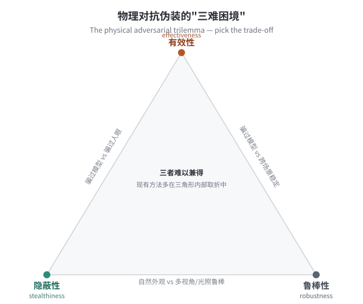

::: {.callout-tip}
## 本章导读
第 5 章的最后一句把读者送到了这里：当守方的目标从"骗过人眼与传感器"升级为"骗过深度神经网络"，物理域生成就进入了**对抗**时代。本章系统讲解这一升级：先把对抗样本的数字基础与物理约束讲清楚（6.1），再区分贴片攻击与全覆盖迷彩（6.2），沿方法谱系走过十年演进（6.3），在三难困境（6.4）处停下来深入分析，转向三维几何感知的必要性（6.5）与单视图重建的新方向（6.6），再从攻防一体的博弈视角看防御（6.7），给出完整的评价口径（6.8），最后拉通本章与全书主线（6.9）。本章是生成篇（第二篇）的技术高峰，也是连通识别篇与评价篇的关键枢纽。
:::

::: {.callout-warning}
## 两用性声明
本章以**理解攻击机理、提升检测器鲁棒性与推动防御研究**为目的，聚焦公开的学术基准与方法原理，不提供针对特定现役系统的可即用攻击配方或部署参数。所有讨论的方法均已公开发表，相关防御与评价维度与攻击方法**成对呈现**。
:::

## 6.1 对抗样本：从数字到物理 {#sec-basics}

### 6.1.1 数字对抗样本的基础 {#sec-digital-adv}

对抗样本（adversarial examples）的核心思想在 2013–2014 年前后被系统化：Szegedy 等首先揭示了深度网络这一"反直觉性质"——对输入施加一个**在人眼看来几乎不可辨的微小扰动**，却足以把网络的预测推翻[@szegedy2014intriguing]，Goodfellow 等随后用线性假说给出了高效的构造方法[@goodfellow2015fgsm]。在数字域，FGSM（快速梯度符号法）沿损失函数梯度方向步进一步[@goodfellow2015fgsm]，PGD（投影梯度下降）则迭代多步并投影回 $\ell_\infty$ 球[@madry2018pgd]，C&W 攻击把可辨性约束写进优化目标[@carlini2017cw]——它们都是在**像素空间**里找到一个最小扰动 $\delta$，使：

$$
f(x + \delta) \neq f(x), \quad \|\delta\|_p \le \epsilon.
$$

这些方法在数字域足够有效，但直接把 $\delta$ 打印出来并不奏效——打印机的色域、相机的 ISP、光照与视角的变化，都会把精心设计的扰动"洗掉"。

为了理解这种"洗掉"为什么致命，必须先区分两层问题。第一层是**决策边界问题**：深度网络在高维输入空间里学习到的分类边界，并不等同于人类感知空间中的语义边界。一个扰动只要沿着模型损失的陡峭方向移动，就可能在像素距离很小的情况下跨过模型边界。第二层是**信道问题**：数字域中的输入 $x+\delta$ 是直接送入模型的张量，而物理域中的纹理必须经过"打印/喷涂--材料反射--光照--相机成像--压缩--预处理"这一长信道，最后才变成模型看到的张量。数字对抗主要解决第一层，物理对抗必须同时解决两层。

对目标检测而言，这个问题又比分类更复杂。分类攻击只要让整张图的类别输出改变即可；检测攻击还要影响**框位置、目标置信度与类别概率**的组合。有些攻击让检测框消失，有些让框偏移到错误位置，有些让类别从"车"变成"背景"或其他类别。因而，物理对抗伪装的损失函数通常不是单一交叉熵，而会混合 objectness、classification、localization 等多项信号。换言之，它不是在问"这张图是什么"，而是在问"图中哪里有什么、置信度多高"。这也是为什么同一张迷彩图案在分类器上有效，不等于在检测器上有效；在单阶段检测器上有效，也不等于在两阶段检测器或分割模型上有效。

从威胁模型看，物理对抗至少包含三个轴。其一是**知识轴**：白盒攻击知道模型结构与参数，可以直接反向传播；黑盒攻击只能查询输出或依赖替代模型迁移。其二是**目标轴**：非定向攻击只要求漏检或置信度下降，定向攻击要求被识别为某个指定类别，后者通常更难。其三是**环境轴**：实验室内固定距离、固定光源、固定相机的设置，与室外多光照、多距离、多传感器的设置不可同日而语。本章后文的评价口径，正是围绕这三个轴展开。

### 6.1.2 物理约束：为什么难 {#sec-physical-hard}

把对抗扰动搬进物理世界，面临四类额外约束，这也是物理对抗区别于数字对抗的本质：

**变换不变性**：一张贴有对抗贴片的停车标志，在不同距离、光照、角度、天气下被不同相机拍摄，扰动必须在所有这些变换后仍然有效。这意味着优化目标不能是"对某一张图有效"，而必须是"对一个变换分布的期望有效"。

**制造误差**：数字像素被转化为打印油墨、织物染料或涂层颜料时，必然引入色域压缩与定位误差。最终贴在目标上的图案，与优化时用到的数字图案之间存在系统偏差。

**几何映射**：要把纹理铺满一辆车，必须考虑车辆曲面的几何——同一块像素在不同视角下对应不同的屏幕区域，且会因曲率产生透视变形。忽略几何直接优化平面纹理，视角变化后通常失效。

**隐蔽性约束**：若纹理过于夸张，虽然能骗过检测器，却在人眼看来极不自然，丧失了"伪装"的本义——一辆漆有随机噪声的车会立刻引起注意。

**期望变换（EOT, Expectation over Transformation）**是应对前两条约束最重要的方法论突破[@athalye2018eot]：在优化时对一组物理变换（旋转、缩放、光照、色彩偏移、打印误差的模拟噪声等）求期望，使目标函数变为：

$$
\arg\min_{\delta}\; \mathbb{E}_{t \sim \mathcal{T}}\bigl[\mathcal{L}\bigl(f(t(x + \delta)),\, y_{\rm target}\bigr)\bigr].
$$

EOT 使优化出的扰动对整个变换分布鲁棒，是此后几乎所有物理对抗方法的基础模块[@csur2026physical]。

但 EOT 不是万能钥匙。它的效果取决于变换分布 $\mathcal{T}$ 是否覆盖真实环境。如果优化时只采样小角度旋转，真实测试却出现大侧视角，所谓鲁棒性就会瞬间失效；如果优化时只模拟均匀光照，真实测试中出现高光、阴影与自动曝光，损失函数中学到的纹理可能被成像链路重新映射。更重要的是，$\mathcal{T}$ 越大，优化越困难：每一步梯度都成为许多随机变换下梯度的平均，信号更稳定但也更弱。因此，EOT 的工程价值在于把"物理世界的不确定性"显式写进优化，而不是保证所有不确定性都被解决。

物理约束还带来一个常被低估的问题：**扰动不再是自由变量，而是材料变量**。数字域的 $\delta$ 可以逐像素独立变化；物理域的纹理却受打印分辨率、油墨混合、织物纹理、涂层反射率、曲面拉伸和接缝位置制约。一个在屏幕上看起来连续的颜色梯度，打印到粗糙布料上可能变成离散色块；一个在渲染器中无反光的区域，真实车漆上可能因镜面反射而大幅偏离。因此，物理对抗伪装不是"把数字攻击搬到现实"，而是"在材料、几何与成像共同约束下重新定义攻击"。

在优化目标上，物理对抗伪装通常不是一个纯粹的攻击损失，而是多项约束的加权和。可以抽象写作：

$$
\min_{\theta} \;
\mathbb{E}_{t \sim \mathcal{T}}
\left[\mathcal{L}_{\rm det}\bigl(f(R(G,\theta,t)), y\bigr)\right]
+ \lambda_1 \mathcal{L}_{\rm perc}(\theta)
+ \lambda_2 \mathcal{L}_{\rm smooth}(\theta)
+ \lambda_3 \mathcal{L}_{\rm print}(\theta),
$$

其中 $\theta$ 是纹理参数，$G$ 是目标几何，$R$ 是渲染与成像过程，$\mathcal{L}_{\rm det}$ 对应检测器损失，$\mathcal{L}_{\rm perc}$ 控制感知自然性，$\mathcal{L}_{\rm smooth}$ 控制纹理平滑与接缝，$\mathcal{L}_{\rm print}$ 控制打印色域和制造约束。这个式子不是具体算法配方，而是说明该问题的结构：攻击项越强，越容易牺牲自然性和制造性；约束项越强，搜索空间越窄，攻击效果越难提升。

这种多项目标也解释了为什么不同论文的"物理对抗迷彩"看起来差异很大。有些方法把 $\lambda_1$ 设得很小，生成纹理明显但效果强；有些方法强调 $\mathcal{L}_{\rm perc}$，纹理更像自然迷彩但攻击率下降；有些方法加入较强的打印或平滑约束，使结果更容易落地但优化更慢。评价时若只看最终 ASR，就会忽略研究者实际在调节哪一个权衡旋钮。严谨比较应报告这些约束项的存在、目的和消融结果，而不必暴露任何可用于复现攻击的敏感参数。

## 6.2 贴片攻击与全覆盖迷彩 {#sec-patch-vs-camo}

物理对抗在**空间布局**上有两种截然不同的形态，选择哪种直接决定了约束结构与应用场景。

**对抗贴片（adversarial patch）**把所有扰动集中在一块有限区域内（一张贴纸、一个印花、一个标志）。它的优势在于：不需要知道目标的三维几何，制造简单，可以在任意视角放在相机视野的任意位置；缺点是只在贴片被完整摄入且显著的条件下生效，视角范围有限，且贴片本身往往显眼，隐蔽性差。

**全覆盖对抗迷彩（full-coverage adversarial camouflage）**把优化出的纹理作为迷彩铺满目标（车辆、无人机等）的全部可见表面，从任何视角都会有一部分对抗纹理进入相机。它支持多视角攻击，隐蔽性可以在优化中显式约束（把"看起来自然"纳入目标函数），是本章的主角，也与第 5 章"数字制造：UV 映射"一脉相承——物理对抗迷彩正是把**对抗优化出的纹理**经 UV 映射铺到三维模型上，再渲染、再打印。

两者的根本差异，可以理解为**局部信号注入**与**整体外观重写**。贴片攻击像是在传感器视野中放置一个高能量触发器，依赖局部区域强烈干扰模型注意力；全覆盖迷彩则把整个目标的表面外观改写为对模型不友好的分布，依赖的是跨视角持续可见的低到中等强度信号。前者更接近"触发器"，后者更接近"外观域迁移"。

这种差异会影响实验设计。评估贴片时，需要报告贴片面积占比、贴片位置、是否遮挡目标关键部位、贴片是否总是完整可见；评估全覆盖迷彩时，需要报告三维模型来源、UV 展开质量、可见表面覆盖率、接缝与遮挡处理、打印或贴膜材料。若不报告这些细节，两个方法的攻击成功率没有可比性：一张占据图像 30% 面积的显眼贴片，与一套看似自然的整车涂装，即使 ASR 相同，也代表完全不同的代价。

从伪装学角度看，贴片攻击往往不是严格意义上的"伪装"，因为它并不一定降低可见性，甚至常常提高显著性；它只是利用模型脆弱性让检测器出错。全覆盖对抗迷彩更接近本书的主线：它必须同时考虑人类观察、背景融合、传感器成像与模型决策。也正因为如此，全覆盖方法更适合作为第 5 章物理生成、第 9 章鲁棒检测、第 15 章统一评价之间的连接点。

还可以按**作用目标**继续细分。若纹理主要降低目标置信度，它属于隐身式攻击；若纹理诱导模型把目标看成另一类，则属于伪装式或误导式攻击；若纹理制造大量虚假框，则更接近诱饵式攻击。三者在战术含义和防御方式上不同：隐身式攻击强调漏检，误导式攻击强调类别混淆，诱饵式攻击强调稀释注意力和资源消耗。本书讨论物理对抗伪装时，主要关注前两类，并把诱饵式攻击作为相关但不同的问题处理。

在视觉形态上，三类目标也会产生不同偏好。隐身式攻击常试图破坏目标的判别性部位，使模型无法稳定聚合目标证据；误导式攻击可能引入与目标类别或替代类别相关的纹理暗示；诱饵式攻击则更关注在背景或目标周围制造误报区域。它们都可以被称为对抗，但不应被放在同一指标下比较。一个漏检型方法若没有制造误报能力，不代表弱；一个诱饵型方法若无法隐藏真实目标，也不代表失败。评价必须先问清楚攻击目标是什么。

这也对应经典伪装中的不同策略：背景匹配追求不被发现，拟态追求被误认为别物，诱饵追求把搜索者注意力引向错误对象。AI 语境中的物理对抗只是把这些策略映射到模型输出空间。这样的映射提醒我们，本章并不是从零发明伪装，而是在现代机器感知系统中重新组织已有伪装逻辑。

## 6.3 方法谱系：十年演进 {#sec-genealogy}

全覆盖物理对抗迷彩的方法谱系，可以沿"如何处理三维几何""如何平衡三难困境""如何提高鲁棒性"三条主线梳理，构成一个清晰的演进图谱。

这条谱系之所以重要，是因为它展示了物理对抗伪装从"能不能成功"逐步转向"在什么条件下成功、以什么代价成功、能否被复现与评价"。早期工作常以少数场景中的惊人失败案例证明模型脆弱性；后续工作则不断把约束补齐：先加入物理变换，再加入人类感知约束，再加入三维曲面，再加入跨视角一致性，最后开始关注重建门槛与真实部署成本。换言之，十年演进不是单纯追求更高 ASR，而是在把一个脆弱性现象改造成可分析、可比较、可防御的工程问题。

**第一代：EOT + 平面近似**。早期物理对抗研究（如 Eykholt、Evtimov 等针对交通标志的误分类攻击，在停车标志上贴出可致误分类的黑白块[@eykholt2018robust]）通过对物理变换（光照、视角、距离）求期望来获得鲁棒性，其思想与 EOT（对变换求期望）一脉相承[@athalye2018eot]。这类工作对目标几何做平面近似，覆盖少数几个面，通过对变换求期望获得基础的物理鲁棒性。优点是简单，缺点是多视角失效。

第一代方法的典型贡献，在于证明了"数字对抗不是屏幕幻觉"。只要把光照、距离、旋转等物理扰动纳入训练，扰动确实可以穿过打印和拍摄信道，影响真实相机后的模型输出。这一点在历史上非常关键：它把对抗机器学习从纯粹的输入张量游戏，推到了传感器系统与实物安全的层面。但第一代方法通常把目标近似为平面，或只攻击目标上少数相对平坦的区域。这样的假设对交通标志、海报、标牌成立，对车辆、人体、无人机这类曲面目标则明显不足。

**第二代：注意力引导 + 语义隐蔽**。**AdvCam** 提出以神经风格迁移把对抗扰动融合为"自然风格的图案"，在欺骗模型的同时使纹理对人眼不突兀[@advcam2020]——这是第一次**把隐蔽性显式纳入优化**的工作，标志着该领域开始正视三难困境的隐蔽性维度。**DAS（双注意力抑制）** 则同时引导模型的注意力（让检测器"看不见"目标区域）与人眼的注意力（让纹理符合自然统计），二者兼顾[@wang2021das]。

第二代方法的关键转向，是承认"攻击成功但图案异常"并不等于"伪装成功"。在许多早期样例中，图案高度噪声化、色彩突兀、纹理违背物体材质常识，虽然能让模型失败，却会让人类观察者立刻警觉。AdvCam 类方法把自然图像风格、纹理统计或语义先验纳入目标函数，试图让对抗纹理看起来像合理的迷彩、涂装或图案。这一步把物理对抗带回伪装本体：真正的伪装不是只对机器不可见，而是要在不同观察者之间制造不对称。

注意力引导的价值在于，它把攻击从"盲目改像素"转向"改模型真正依赖的区域"。检测器往往关注目标轮廓、边缘、轮胎、车窗、机翼等判别性部位；如果纹理优化能优先干扰这些区域，攻击效率会更高，所需扰动也可能更小。与此同时，人眼注意力也并不均匀：自然纹理中的重复、边界、颜色突变都会吸引注意。双注意力思想的本质，就是让机器注意力被抑制，让人类注意力被安抚。

**第三代：可微渲染 + 全曲面**。这一方向的源头是 **CAMOU**（Zhang 等，ICLR 2019）：它首次提出学习一整套铺满车辆表面的迷彩，以黑盒方式在仿真环境中把车辆从检测器视野中"抹去"，开辟了全覆盖车辆对抗迷彩这一子领域[@zhang2019camou]。在此基础上，**FCA（Full-coverage vehicle Camouflage Attack）** 系统化地用可微渲染把对抗纹理铺到车辆全曲面，并对多视角求期望，展示了真正意义上的"从任意视角都有效的迷彩"[@wang2022fca]；同期的 **DTA** 则用可微变换网络（DTN）学习纹理改变时物体外观的期望变换，补齐了神经渲染器难以刻画的真实光照与材质效应[@suryanto2022dta]。可微渲染使"3D 纹理→多视角 2D 图像→检测损失"这一链条完全可微，梯度可回传到纹理空间，是此后方法的标配框架。

第三代方法解决的是物理对抗迷彩最硬的工程瓶颈：**梯度应该回到哪里**。在二维图像上优化时，每个像素的含义清楚；在三维目标上优化时，一个屏幕像素可能来自车门、车顶、前保险杠或曲面边缘。没有几何映射，优化器只能看到渲染图像的损失，却不知道应当修改 UV 纹理中的哪个位置。可微渲染把这种对应关系显式化，使每个视角的图像损失都能回传到同一张纹理图上。多视角损失在纹理空间相加，才形成真正意义上的全覆盖优化。

不过，全曲面并不意味着所有表面同等重要。某些表面常被遮挡，某些表面在常见视角中占据更大像素面积，某些区域对检测器特征更关键。成熟方法通常会隐式或显式地产生一种"可见性加权"：高频出现在图像中的表面获得更强梯度，少见区域获得较弱梯度。这说明，物理对抗迷彩不是给目标均匀涂上一层噪声，而是在三维可见性、传感器投影和模型注意力共同作用下形成的表面分配问题。

**第四代：鲁棒性深化**。**RAUCA（Robust and Accurate UV-shape Camouflage Attack）** 通过一个神经渲染增强组件（NRP）与多天气数据集精细化 UV 空间的梯度传播、提高攻击精度与环境鲁棒性[@zhou2024rauca]；**PhyCamo** 以**对比学习**框架显式建模"多视角的一致鲁棒性"——让同一辆车从不同角度拍摄的图像在特征空间对齐，使鲁棒性从期望约束升级为显式监督信号[@phycamo2025]。这一代方法在三难困境的"鲁棒性"维度取得了显著进步。

第四代方法的共同特点，是不再满足于"在随机变换平均意义上有效"，而是追问鲁棒性本身如何被学习、度量和约束。对比学习提供了一种自然语言：同一目标在不同视角、光照和距离下应当形成一组正样本；不同目标或背景形成负样本。若对抗纹理能在这些正样本之间稳定地压低检测相关表征，说明它不是偶然利用某一个视角的漏洞，而是在更深层的特征空间制造一致扰动。这一思想把物理鲁棒性从输入空间的随机增强，推进到表征空间的一致性约束。

方法谱系还可以按"所需资产"划分。传统全覆盖方法通常需要目标的三维模型、UV 展开、相机姿态和渲染管线；单视图或少视图重建方向则试图从普通图像中恢复这些资产。前者更可控，适合严谨实验；后者更实用，适合讨论真实环境下的准入门槛。二者没有谁取代谁的问题：高质量 3D 资产仍是研究上限，低成本重建则决定方法能否走出实验室。

@tbl-methods 概览这条谱系的关键节点。

| 方法 | 主要贡献 | 几何处理 | 三难困境侧重 |
|------|----------|----------|--------------|
| EOT 类（早期） | 物理变换期望 | 平面近似 | 有效性 |
| CAMOU | 全覆盖车辆迷彩的开端（黑盒克隆网络） | 仿真曲面 | 有效性 |
| AdvCam | 神经风格迁移隐蔽化 | 平面 + 局部曲面 | 隐蔽性 |
| DAS | 双注意力抑制 | 部分曲面 | 有效性 + 隐蔽性 |
| FCA | 全曲面可微渲染 | 完整 UV 曲面 | 有效性 + 鲁棒性 |
| DTA | 可微变换网络逼近真实渲染 | 完整曲面 | 有效性 + 鲁棒性 |
| RAUCA | 精细 UV 梯度 + 多天气 | 完整 UV 曲面 | 有效性 + 鲁棒性 |
| PhyCamo | 对比学习多视角 | 完整 UV 曲面 | **鲁棒性**显式 |
| CAM3D | 单视图→3D重建 | 无需3D资产 | 实用性 |

: 全覆盖物理对抗迷彩方法谱系（按演进顺序） {#tbl-methods}

从表中可以看到，"先进"并不等于在所有维度上更好。CAMOU 的历史意义在开辟全覆盖车辆迷彩，AdvCam 的历史意义在隐蔽性，FCA 的历史意义在几何闭环，PhyCamo 的历史意义在鲁棒性显式建模，CAM3D 的意义在降低资产门槛。若用单一 ASR 排序，就会抹平这些贡献。本章采用谱系叙述，正是为了避免把不同问题压扁成一个分数。

还有一条隐含的演进线，是从**单模型攻击**走向**系统级评估**。早期论文常以一个检测器作为对象，证明该模型会失败；随后研究开始比较 YOLO、Faster R-CNN、SSD 等不同架构上的迁移；再往后，视频、跟踪、多模态和防御预处理逐渐进入评价。这个趋势说明，物理对抗伪装的真正难点不是找出某个模型的漏洞，而是判断漏洞是否跨系统存在。若一个图案只欺骗某个已知白盒模型，它更像模型特例；若它能跨架构、跨相机、跨环境保持效果，它才更接近物理伪装研究的核心问题。

与之并行的，是从**效果展示**走向**失败分析**。成熟领域不会只展示成功样例，而会系统列出失败条件：哪些角度失败、哪些背景失败、哪些光照失败、哪些目标实例失败。物理对抗伪装尤其需要失败分析，因为它的边界常常由物理因素决定，而不是由模型指标直接解释。一个方法在阴天有效、晴天强反光失效；在近距离有效、远距离纹理被采样模糊后失效；在干净背景有效、复杂背景中失效。这些失败比成功图更有科学信息。

## 6.4 三难困境：有效性、隐蔽性、鲁棒性 {#sec-trilemma}

贯穿 6.3 节整条谱系的，是一个反复浮现却始终未被消解的根本张力。@fig-trilemma 把它几何化：

{#fig-trilemma width=72%}

三个维度各自的含义与相互冲突的根源如下。

**有效性（effectiveness）**：在目标检测器上，是否成功降低了目标被检测/分类的置信度？衡量指标通常是 AP（平均精度）的下降幅度或攻击成功率（ASR）。

**隐蔽性（stealthiness）**：纹理对人眼是否自然？是否会引起注意？衡量需要结合感知距离（LPIPS、SSIM）与用户研究。纹理越"怪"往往越有效（大幅偏离正常分布的纹理更易把模型推出决策边界），但也越不自然——这是有效性与隐蔽性冲突的根源。

**鲁棒性（robustness）**：跨视角、跨光照、跨天气、跨目标模型，效果是否稳定？提高鲁棒性通常需要对更大的变换分布求期望，这会稀释梯度信号、使每个特定条件下的攻击力度下降——这是有效性与鲁棒性冲突的根源。隐蔽性与鲁棒性之间也存在张力：追求视觉自然往往限制了纹理的搜索空间，使鲁棒化更难。

这三条边上的矛盾，并不只是工程层面的"还没做到"，而有**更深的信息论根据**：任何有效的对抗扰动，本质上是把输入推出当前模型的决策边界；决策边界通常不在人类感知自然的流形上，也不在多视角不变的流形上——三个目标所要求的信号"指向不同的方向"，同时最优是不现实的[@csur2026physical; @wei2024decade]。

可以用三个极端点理解这种张力。若只追求有效性，最直接的做法是允许大面积、高对比、高频率、非自然纹理；它们携带强对抗信号，但也最不像伪装。若只追求隐蔽性，纹理会被限制在自然图案或背景统计附近；它更像正常涂装，却可能不足以穿越模型边界。若只追求鲁棒性，优化会覆盖大量视角与环境条件；单个条件下的攻击强度会被平均稀释，且训练成本上升。真实方法只能在三角形内部选点，而不能同时坐在三个顶点上。

三难困境还解释了为什么论文之间经常"各说各话"。有的论文在固定白盒模型上 ASR 很高，但没有真实打印；有的论文真实打印表现不错，但只测少数视角；有的论文纹理自然，但攻击效果有限；有的论文跨模型迁移强，却没有做人因隐蔽性评估。它们都可能是有价值的研究，但价值坐标不同。评价者若不先标定坐标，就会把"在一个维度上进步"误读为"总体更优"。

认识三难困境的意义，不只是悲观地说"做不到"，而是为评价与比较提供了**正确的坐标系**：一篇论文声称"攻击更有效"，必须同时报告它的隐蔽性代价与鲁棒性范围；否则，"在单一静止视角、白盒模型下的成功"只是三角形某个顶点的移动，不构成全面进步。这正是第 15 章评价篇中"物理对抗需要多维 scorecard"的依据，也呼应了物理对抗十年综述对"全面评价"的呼吁[@wei2024decade]。

因此，物理对抗伪装的合理目标不是寻找一个绝对最优图案，而是寻找一组**帕累托前沿**：在给定隐蔽性阈值和物理可实现性约束下，攻击效果能达到多高；在给定攻击效果下，跨视角和跨模型鲁棒性能覆盖多广；在给定鲁棒性范围内，纹理能否保持自然。工程上可以把这些约束写成多目标优化；评价上则应把每个目标单独报告，并展示阈值变化时曲线如何移动。

帕累托视角也能帮助防御研究。若一种防御只让攻击者把纹理变得更显眼，却不能完全阻止攻击，它仍然有价值：它把对手从"隐蔽且有效"的位置推向"有效但显眼"的位置，提高了人类巡检或其他传感器发现的机会。反过来，若一种防御只在固定视角下有效，却让攻击者通过扩大 EOT 分布轻易绕过，它就只是局部改进。攻防双方实际争夺的，不是某个点，而是整个帕累托前沿的位置。

下面用一个一维玩具展示三者的基本张力——只是帮助直觉，不代表任何真实系统：

```{python}
#| label: fig-trilemma-demo
#| fig-cap: "三难困境的玩具示意：固定总预算下，把更多比例分给鲁棒性约束，有效性（攻击强度代理）下降；分给隐蔽性约束，有效性同样下降。真实方法在三维曲面上寻找帕累托折中。"
#| code-fold: true
import numpy as np
import matplotlib.pyplot as plt

alpha = np.linspace(0, 1, 50)   # α fraction given to robustness
beta  = np.linspace(0, 1, 50)   # β fraction given to stealthiness
A, B  = np.meshgrid(alpha, beta)
mask  = (A + B) <= 1            # feasible region: alpha+beta <= 1

# proxy: effectiveness = remaining budget (1 - alpha - beta), clipped
E = np.where(mask, 1 - A - B, np.nan)

fig, ax = plt.subplots(figsize=(6, 4.5))
cf = ax.contourf(A, B, E, levels=12, cmap='RdYlGn')
plt.colorbar(cf, ax=ax, label='effectiveness proxy')
ax.set_xlabel('robustness budget α')
ax.set_ylabel('stealthiness budget β')
ax.set_title('The Trilemma: more robustness or stealthiness → less effectiveness')
ax.set_aspect('equal')
# mark some representative methods conceptually
pts = {'EOT-era\n(effective)':(0.1,0.05),
       'AdvCam\n(stealthy)':(0.1,0.55),
       'PhyCamo\n(robust)':(0.55,0.1)}
for label,(x,y) in pts.items():
    ax.scatter(x,y,s=60,color='#2b2f36',zorder=5)
    ax.annotate(label,(x,y),textcoords='offset points',
                xytext=(6,4),fontsize=8,color='#2b2f36')
plt.tight_layout()
```

## 6.5 三维几何感知的必要性 {#sec-3d}

为什么全覆盖迷彩必须显式建模三维几何？直觉上，"对多视角求期望"难道不够吗？

根本问题在于：当纹理铺在曲面上时，同一块像素在不同视角下对应目标表面的**不同位置**，且曲率会引入透视变形。如果在 UV 纹理空间优化、却用随机变换来近似多视角，梯度信号会因为几何不一致性而模糊——优化器"不知道"某个像素在侧视图对应目标哪个部位，导致最终纹理在正面视角勉强有效、在侧视图却失效。

**可微渲染（differentiable rendering）**解决了这个问题：通过一个可微的 3D→2D 投影管线，把 UV 纹理空间的梯度与多视角图像空间的梯度正确关联起来，梯度可以沿"纹理→三维曲面→渲染图像→检测损失"这一链条完整回传。FCA 等方法正是以此为基础，首次实现了真正意义上的全曲面多视角物理对抗迷彩。

更具体地说，三维几何感知至少包含四个子问题。第一是**表面参数化**：把复杂曲面展开到二维 UV 纹理图，使优化器能够在一个规则网格上更新颜色。第二是**可见性计算**：某个视角下哪些三角面可见、哪些被遮挡，决定了梯度是否应该回传到对应纹理区域。第三是**投影与采样**：三维表面点如何投影到图像像素，涉及相机内参、外参、透视变形和抗锯齿。第四是**材质与光照**：同一纹理颜色在不同光照下会变成不同图像颜色，若忽略反射模型，仿真与真实之间会出现系统偏差。

这些子问题解释了为什么"随机裁剪、旋转、缩放"不能替代三维建模。二维增强把整张图当作平面处理，只能模拟相机对已经成像的图像做变换；真实物体的视角变化则先改变可见表面，再改变投影形状，最后才形成图像。车门侧面在正视图中几乎不可见，在侧视图中占据大量像素；车顶在低机位几乎不可见，在高机位成为显著区域。二维增强无法创造这种表面可见性变化，因此只能提供有限鲁棒性。

三维感知还让**纹理连续性**成为可控对象。真实迷彩不能在 UV 接缝处出现明显断裂，也不能在曲率大的位置产生不自然拉伸。若优化只在图像空间进行，接缝通常不可见；一旦打印成物理纹理，接缝会暴露。UV 空间优化可以加入平滑项、总变差约束、接缝一致性约束和色域约束，使生成图案更接近可制造纹理。这些约束看似是美术和制造问题，实质上决定了物理攻击能否从论文图进入真实测试。

近年来，**NeRF（神经辐射场）**[@mildenhall2020nerf]与**3D 高斯泼溅（3D Gaussian Splatting, 3DGS）**[@kerbl20233dgs]把三维几何与材质的表达能力进一步提升：NeRF 可以从多张普通照片重建出高保真的体积表达，包括复杂的光照与材质；3DGS 则以更高效的显式高斯表达实现实时渲染。把这些三维表达引入物理对抗，使得：① 目标模型可以从照片而非手工 3D 资产建立，**降低了准入门槛**；② 渲染的物理保真度更高，优化出的纹理在真实打印与拍摄中的表现更稳定[@csur2026physical]。这条方向与三维重建领域的快速发展深度耦合，是近两年最活跃的前沿之一。

不过，NeRF 与 3DGS 引入的不是免费收益。它们把问题从"我有一个干净网格和 UV"变成"我有一个可渲染场，但如何在其中编辑、约束和制造纹理"。NeRF 的表示连续而隐式，适合高质量重建，却不天然对应可打印的二维纹理；3DGS 渲染快，但高斯点的颜色、透明度和尺度与真实材料之间仍有距离。因此，前沿研究需要在高保真重建与可制造纹理之间搭桥：既要让渲染足够逼真，又要把结果落回喷涂、贴膜、织物印花等可执行载体。

对本书而言，三维几何感知的核心意义不只是"攻击更强"，而是把第 5 章的物理生成管线与第 6 章的对抗优化闭合起来。第 5 章讲 UV、材质、制造和渲染；第 6 章说明这些步骤一旦进入梯度循环，就变成物理对抗的基本设施。没有这个闭环，物理对抗只是二维图像扰动；有了这个闭环，它才成为真正的物体外观设计问题。

## 6.6 单视图重建：实用化的新方向 {#sec-cam3d}

即便有了可微渲染，获取高质量目标三维模型仍是实用化的一大门槛：精确的车辆/无人机三维资产需要多视图拍摄、激光扫描或购买商业模型，在实际场景中往往难以获取。

**CAM3D** 提出了一条从**单张图像**出发的路径：给定目标的一张 RGB 图，以 Mamba 架构的逆图形网络推断目标的三维几何与材质，再在这个重建的三维表达上生成物理对抗迷彩[@cam3d2025]。这把数据需求从"多视图 + 精准对齐"降低到"单张图片"，极大地提升了实用性。

从方法论上，CAM3D 把**单目三维重建**（计算机视觉中一个成熟的大问题）与物理对抗生成串联，是两个领域的交叉融合。其核心挑战在于单目重建天然存在的深度歧义性——同一张图对应无穷多种三维配置，重建误差会传播进纹理优化，导致真实场景中的精度损失。如何降低重建不确定性对攻击质量的影响，是该方向持续改进的重点。

单视图路线的实用性，来自它把"资产获取"从昂贵前置条件变成模型预测问题。传统全覆盖实验往往需要 CAD 模型、扫描模型或手工建模，这使许多真实目标无法快速进入评估；单视图重建只需要目标照片，就能估计大致形状、姿态和可见表面，为快速仿真和红队评估提供入口。在防御研究中，这种能力同样有价值：研究者可以从公开图像或现场照片快速生成近似三维代理，用来测试检测器对外观扰动的敏感性，而不必先建立高精度数字孪生。

但单视图路线必须诚实报告不确定性。一个正面图像通常无法确定侧面细节，一个低分辨率图像无法恢复小尺度结构，遮挡物背后的几何更是不可观测。若评估只在重建模型上进行，很可能高估或低估真实效果。因此，较完整的协议应当同时报告三类结果：重建模型上的仿真效果、少量真实打印或实物代理上的物理效果、以及重建误差对攻击指标的敏感性。只有这样，单视图方法的"低门槛"才不会变成"低可证性"。

从未来发展看，单视图、少视图、多视图并不是互斥路线，而是不同预算下的连续谱。低预算快速评估可以用单视图；中等预算可以加入少量多角度照片校正几何；高预算实验则使用扫描或 CAD 模型作为上限。`camo-eval` 在第 15 章中采用协议化输入，正是为了让这些不同资产水平的实验在同一评价框架下被标注和比较，而不是混为一谈。

## 6.7 防御：攻防一体的博弈视角 {#sec-defense}

把物理对抗迷彩仅当作"攻击"研究，在认识论上是不完整的。第 1 章博弈框架给出了更完整的视角：**每一种有效的攻击，都在精确揭示检测器的弱点，从而成为防御研究的指向标**。

面向物理对抗迷彩的防御，大致沿以下几条路线展开：

**数据增强与对抗训练**：在训练集中加入物理对抗样本，迫使检测器学习"在对抗纹理存在时也能检测目标"的特征。代价是训练成本更高，且对未知攻击的迁移性有限。

这一类方法的核心不是简单"多加一些坏样本"，而是覆盖足够宽的物理变换分布。若训练样本只包含某一种图案、某一个视角或某一种相机，模型可能学到的是特定纹理的黑名单，而不是对物理对抗的通用鲁棒性。更严格的做法，是在训练过程中动态生成或采样多种对抗外观，并把视角、光照、距离和压缩作为随机变量。这样做计算昂贵，但更接近真实威胁。

**输入变换与净化**：对输入图像施加随机变换（随机缩放、JPEG 压缩、空间平滑）破坏对抗扰动的结构；或用扩散模型对输入"净化"以还原原始分布。后者在数字域已有显著进展，迁移到物理场景仍面临计算开销与变换不一致性的挑战。

输入变换类防御的优点是模型无关，缺点是容易出现"安全感错觉"。如果攻击者知道预处理流程，就可以把这些变换纳入 EOT；若预处理过强，又会损害正常检测性能，尤其是远距离小目标和低照度场景。净化方法同样存在张力：把图像拉回自然分布可能削弱对抗纹理，但也可能抹掉真实目标的细节。防御评价必须同时报告干净样本性能和攻击样本性能，否则很容易用降低整体敏感度换取表面鲁棒性。

**特征一致性约束**：要求检测器的内部表征对输入的物理变换（视角、光照）保持一致，从而对抗"利用视角敏感性"的物理攻击。

特征一致性更接近问题根源。物理对抗之所以有效，部分原因是检测器在不同视角和外观下的表征不稳定；若同一物体的多视角特征能被约束到稳定流形，纹理扰动就更难把它推出目标类别。但一致性也不能过度：物体的真实外观随视角变化，强行压平所有差异可能降低细粒度识别能力。因此，一致性防御需要与三维、时序或多模态信息结合，而不是孤立地约束单帧特征。

**多模态融合**：如第 3.3 节与第 9 章所述，骗过可见光的对抗迷彩未必骗得过红外或多光谱传感器。把多个信道的信号融合，本身就是对针对单信道优化的对抗迷彩的天然防御[@csur2026physical]。

多模态防御的强处在于迫使攻击者同时满足多个物理约束。可见光图案主要改变反射颜色，红外成像关注热辐射或热对比，雷达关注形状和材料电磁特性，多光谱关注跨波段反射曲线。一个纹理在 RGB 中有效，不代表在热红外、近红外或雷达中也能隐藏。第 3 章已经说明军事伪装从来不是单通道问题；在 AI 对抗语境下，这一点更重要，因为单模型攻击很容易被跨模态冗余抵消。

防御还可以利用**时序一致性**。许多物理对抗纹理在单帧中能降低检测置信度，但视频中目标会连续运动，检测器或跟踪器可以利用运动轨迹、尺寸变化和背景相对位移恢复目标存在。若一辆车在相邻帧中形状、运动和阴影都连续，而检测框突然消失，这本身就是异常信号。因而，视频级评价不能只取单帧 ASR 平均，还应报告轨迹断裂、重识别失败、时间稳定性等指标。

这一攻防结构的完整图景，与第 15 章的鲁棒性评价直接对应：**评价攻击必须同时评价它在已知防御下的穿透力**；评价防御必须同时评价它对未知攻击的泛化。任何只报"白盒攻击成功率"的论文，都只给出了图景的一角。

从工程落地看，防御研究的最低要求是建立清晰的基线矩阵：干净数据上的原始性能、无防御时的攻击效果、有防御时的攻击效果、防御对正常样本的副作用、攻击者知道防御后的自适应攻击效果。缺少最后一项时，防御常常只是"梯度遮蔽"或"非自适应攻击下有效"。本书不展开具体自适应攻击流程，但强调评价原则：任何防御都应假定攻击者会读论文、会把公开防御纳入优化，并据此重新测试。

## 6.8 评价口径：如何判断"赢了" {#sec-eval}

物理对抗伪装领域一个突出的问题，是"成功"的定义极不统一。以下是出版级评价应当覆盖的完整维度。

**攻击有效性**：检测器在目标数据集上的 AP（平均精度，通常是 AP@0.5 或 AP@[0.5:0.95]）下降幅度；或攻击成功率（ASR，目标检测器把目标误判/漏检的比例）。这是最基础的维度，但**必须说明**测试视角范围、目标模型是白盒还是黑盒、以及是否在真实打印+拍摄条件下测试。

有效性指标应区分三种口径。第一是**绝对性能**：攻击后 AP、mAP、F1 或 Recall 还剩多少。第二是**相对下降**：相对于无攻击基线下降多少百分比。第三是**条件成功率**：在目标原本能被正确检测的样本中，有多少被攻击后漏检或误检。第三种口径最公平，因为如果基线本来就检测失败，把这些样本算作攻击成功会夸大效果。对于检测任务，还应报告置信度阈值和 IoU 阈值，因为阈值变化会显著改变 ASR。

**隐蔽性**：与正常迷彩/自然图案的感知距离（LPIPS、SSIM）；用户研究中是否被注意到异常；若有人因实验（反应时、命中率）则尤佳。

隐蔽性不能只用像素距离衡量。SSIM 偏向结构相似，LPIPS 偏向深层感知差异，颜色直方图或纹理统计能描述低层外观，人因实验则直接测量观察者是否注意到异常。较理想的做法，是把隐蔽性分成**图像相似度**、**自然性评分**和**任务影响**三层：图像相似度回答"像不像参考纹理"，自然性评分回答"看起来是否合理"，任务影响回答"是否影响人类搜索、识别或注意"。三层都重要，但不能互相替代。

**鲁棒性**：跨视角（仰角、方位角范围）、跨光照条件（室内/室外/不同时段）、跨目标检测器（黑盒迁移性）、跨天气/遮挡的成功率保持情况[@wei2024decade]。

鲁棒性报告应使用分层表格，而不是只给一个平均值。平均值会掩盖脆弱区间：一个方法在正面视角极强、侧面视角完全失效，平均 ASR 可能仍然不错；但对真实场景而言，失效角度就是关键风险。更好的做法是报告视角-距离-光照网格上的热力图，或至少报告最坏分位数，例如最低 10% 条件下的 ASR。对防御来说，最坏条件同样重要，因为真实部署往往失败在边界条件而不是平均条件。

**物理可实现性**：是否真正打印并贴到真实目标上进行了测试？数字仿真结果与物理结果之间的差距是多少？这一维度是"实验室攻击"与"真实攻击"的根本分野。

物理可实现性需要记录材料和流程，而不只是写"打印后测试"。至少应说明打印设备或色域限制、介质类型、目标表面处理、安装方式、图案尺寸、相机类型、拍摄距离、光照环境和后处理流程。对于全覆盖迷彩，还应说明曲面贴合、接缝处理和局部遮挡。这里的目的不是提供部署配方，而是让科学比较成立：同一数字纹理在纸张、布料、车膜、哑光涂层和亮面涂层上的成像差异可能很大。

**制造误差鲁棒性**：打印偏色、安装错位、材料褪色等系统误差下，攻击效果的降级幅度。

制造误差不应被当作噪声脚注，而应成为单独实验。实际系统中最常见的失败，往往不是优化目标写错，而是颜色偏了、贴歪了、接缝露了、材料反光了、尺度不准了。评价时可以在仿真中加入色彩偏移、局部错位、模糊、皱褶和反光扰动，再用少量真实样本校准这些扰动的范围。这样得到的结果比单次完美打印更接近真实可复现性。

`camo-eval` 工具包（第 15 章）把以上维度统一进 `metrics/robustness` 与 `metrics/generation` 两组接口，使跨论文的定量比较成为可能。

综合以上维度，一个较完整的报告模板应包含：数据集与目标类别、目标模型与访问假设、攻击目标、纹理生成约束、仿真渲染设置、物理制造设置、干净基线、攻击后有效性、隐蔽性、鲁棒性矩阵、物理-仿真差距、制造误差敏感性、已知防御下表现、失败案例可视化。失败案例尤其重要，因为它们揭示方法的真实边界：哪些视角失败、哪些背景失败、哪些目标实例失败，往往比平均分更能指导下一步研究。

这也是本章与 `camo-eval` 的接口。`camo-eval` 不应只输出一个分数，而应输出一组可组合指标：检测下降、掩膜/边界质量、背景相似度、感知距离、跨条件方差、最坏分位数、视频稳定性、人因可见性代理等。物理对抗伪装的评价对象是一个多维系统，工具也必须承认这种多维性。第 15 章的统一标尺，不是把差异抹平，而是把差异放到同一张表中。

在具体实验中，可以把评价流程拆成四层。第一层是**单帧数字仿真层**：输入渲染图或数据集图像，评估攻击后检测指标下降、纹理与参考外观的感知差异。这一层成本最低，适合快速筛选方法，但不能宣称物理有效。第二层是**多条件仿真层**：系统采样视角、距离、光照、压缩、遮挡和传感器参数，生成条件网格或随机场景，报告平均值、方差和最坏分位数。这一层开始评估鲁棒性。第三层是**受控物理层**：在室内或半室外环境中进行打印、贴附和拍摄，控制变量明确，便于复现。第四层是**开放物理层**：在更自然的环境中采集视频或多时段数据，考察方法在真实波动下的降级。四层之间的结论强度不同，论文和工具都应明确标注。

对于"目标是否被看见"这一核心问题，单帧检测指标仍然不够。若目标检测器给出了低置信度框，分割模型可能仍能勾出轮廓；若检测器漏检，跟踪器可能通过上一帧轨迹继续维持目标；若 RGB 模型失败，红外模型可能正常工作。因此，评价应尽量包含**任务链**而非单模型节点。面向自动驾驶或监控系统，可以报告检测、跟踪、重识别、告警四个环节的变化；面向军事侦察，可以报告可见光、多光谱、热红外和人工判读的分层结果。对抗伪装真正影响的是系统决策链，而不只是某个神经网络输出。

同时，应避免把"模型失败"直接等同于"人类失败"。许多物理对抗纹理正是利用模型与人眼之间的特征差异：模型可能被高频纹理、局部边缘或类别相关纹理误导，人类却仍然一眼看出目标；反过来，经典生物伪装可能让人类搜索变慢，却未必能欺骗现代检测器。因而，人因评价不是可选装饰，而是区分"机器对抗"与"综合伪装"的关键。最小可行的人因实验可以采用二选一检测、反应时、主观自然性评分或异常发现率；更完整的实验则可引入眼动、搜索路径和任务负荷。

评价还必须面对**数据泄漏与选择偏差**。若攻击纹理在与测试场景高度相似的背景、光照或相机上优化，再在同一类场景中测试，结果会偏乐观。若只展示成功图片，不展示失败案例，读者无法判断边界条件。若只选择检测器本来不稳定的样本，攻击成功率也会被夸大。因此，严谨协议应预先定义测试集、视角范围和统计口径，并报告所有样本或随机种子，而不是事后挑选最有利结果。`camo-eval` 的协议化入口正是为减少这类选择自由度而设计。

可视化结果是评价协议的一部分，而不是展示附件。对每个样本，至少应能看到原图、攻击后图像、检测框变化、置信度变化、掩膜或纹理区域、关键指标分数；对多条件实验，应能看到视角或光照维度上的热力图；对视频，应能看到帧级分数曲线和轨迹断裂位置。没有可视化，指标很难被审计：一个高 ASR 可能来自真实漏检，也可能来自阈值设置、框匹配错误或预处理差异。可视化把评价从黑箱数字拉回可检查证据。

因此，本项目的 demo 设计采取"能跑、能看、能比较"的原则。CLI 负责批量和可复现，Python API 负责研究集成，Colab/Codespace 负责零门槛运行，HF Space 负责交互演示。示例数据集不追求覆盖所有真实场景，而是覆盖评价形态：图像级检测、掩膜级比较、背景相似度、物理扰动、视频稳定性、对抗前后可视化。这样的 demo 不能替代严肃论文实验，但能让读者理解每个指标在看什么、为什么单一分数不够。

最后，物理对抗伪装的评价应当鼓励**可复现实验包**：包含数字纹理、渲染脚本、测试图像或视频、模型配置、指标脚本和可视化输出。重模型生成过程可以因安全和资源原因不完全开放，但评价输入和结果应尽量开放。没有可复现实验包，跨论文比较只能停留在表格数字；有了实验包，社区才能在相同样本上比较新指标、新防御和新可视化。这也是本项目推动 CLI、Python API、Colab 与 HF Space 的原因：评价工具只有真正能跑，才能从概念变成公共基础设施。

当然，可复现不等于无边界开放。对于两用性强的场景，可以开放评价数据、指标脚本和防御基线，限制面向真实目标的生成细节；可以开放低风险示例图，避免提供可直接迁移到敏感系统的纹理；可以开放协议，而不是开放所有攻击优化参数。这种分层开放既保证科学审计，又降低误用风险。第 15 章采用"核心库 + 扩展模块 + 外部实验协议"三层结构，也是同一思想在工具设计上的体现。

还应区分研究性评价与作战性评价。前者关心方法是否揭示模型弱点，后者关心系统在任务链中是否仍能完成发现、确认和响应。本书和 `camo-eval` 主要服务前者，并为后者提供可迁移的指标语言；二者不能混同。把研究指标直接解释为现实任务成败，既不严谨，也会放大两用风险。

## 6.9 与全书主线的回扣 {#sec-06-synthesis}

物理对抗伪装是本书主线——隐藏 ⇄ 揭示的协同演化博弈——在当代 AI 语境下最具体的体现之一。沿第 1 章框架梳理：

$H$ = 全覆盖对抗纹理（对抗优化器在 UV 空间里搜索）；$S$ = 目标检测器（深度神经网络）；$C$ = 可见光图像（摄像头拍摄的 RGB 帧）；$U$ = 检测器的 AP（对 $S$ 而言越高越好，对 $H$ 而言越低越好）。

这个四元组的特殊之处在于，$H$ 不再只是自然选择、人工涂装或经验设计的产物，而是一个可微优化器的输出；$S$ 也不再只是人眼或传统传感器，而是深度神经网络。于是，第 1 章中抽象的"隐藏者--搜索者"博弈，在这里变成了损失函数、梯度、渲染器和数据集。隐藏者通过优化纹理降低 $S$ 的效用，搜索者通过训练、融合和防御提高自己的效用。双方都在同一个数据-模型生态中更新策略。

极小极大目标 $\min_H \max_S U(H,S;C)$ 在此处被写成梯度优化的闭合形式，是整本书中"博弈被最显式地工程化"的一章。三难困境表明这场博弈没有纳什均衡可以轻易达到；EOT 和可微渲染则是当前工程中最接近"正确求解"博弈的手段。

但这个极小极大式还少了两个现实项。第一是环境分布 $C \sim \mathcal{D}$：伪装不是对单一图像有效，而是要对一类场景有效。第二是成本约束 $\Omega(H)$：纹理不能无限复杂、无限显眼、无限昂贵，也不能违背制造条件。更完整的写法应当接近：

$$
\min_{H \in \mathcal{H}} \; \mathbb{E}_{C \sim \mathcal{D}}
\bigl[U(H,S;C)\bigr] + \lambda \Omega(H),
$$

其中 $\Omega(H)$ 可以包含感知自然性、色域约束、平滑性、材料限制和制造误差敏感性。若搜索者 $S$ 也参与更新，则会形成交替优化或在线博弈：隐藏者根据当前检测器生成纹理，搜索者根据这些纹理增强训练，隐藏者再寻找新的漏洞。这正是对抗机器学习的基本循环，也是自然伪装、军事伪装和 AI 伪装在机制上的同构。

这一同构有助于避免两个误区。第一个误区是把物理对抗看成纯粹的"黑客技巧"。事实上，它揭示的是识别系统对外观统计、视角变化和训练分布的依赖，是理解机器视觉边界的重要实验方法。第二个误区是把对抗迷彩看成经典迷彩的终结。事实上，经典迷彩中的背景匹配、破坏性着色、轮廓打断、材质控制和多光谱管理，在物理对抗中仍然有效，只是它们被放进了新的优化框架。AI 没有取消伪装学，而是把伪装学的一部分数学化了。

同时，本章也是第一篇（前世今生）、第三篇（识别）、第四篇（评价）的交汇处：物理域的攻击催生了识别篇的鲁棒检测研究（第 9、11–14 章），也推动了评价篇对"多维 scorecard"的需求（第 15 章）。下一章转入数字域：当"隐藏"的对象不再是物体，而是信息、身份与决策。

与第 3 章军事伪装相比，本章的方法更强调机器感知；与第 2 章自然伪装相比，本章的进化时间被压缩到优化迭代；与第 5 章物理生成相比，本章把生成目标从"看起来像"改为"让模型错"；与第 15 章评价相比，本章提供了最需要多维评价的压力测试场景。这样的交汇位置决定了第 6 章不是孤立技术章节，而是全书的一个枢纽：它把自然、军事、生成、识别和评价五条线合并到同一个实验对象上。

也正因为如此，本章采用了克制的安全写法。我们讲清攻击机理，是为了让读者理解鲁棒性为何困难；讲清评价协议，是为了避免夸大或误读；讲清防御，是为了把攻击重新放回协同演化。对抗研究的价值不在于制造不可防御的漏洞，而在于把系统的隐含假设暴露出来，让下一代搜索者更稳健，让下一代评价更诚实。

这一定位也帮助理解后续章节的分工。第 7 章讨论数字域中的伪装与信息隐藏，那里没有打印、曲面和材料，却有数据分布、身份表征和生成模型的语义操控；第 8 章以后进入检测与分割，关注搜索者如何在复杂场景中重新建立稳定证据；第 15 章再把这些生成和识别问题放回统一评价框架。第 6 章因此像一座桥：一端连接实体世界的迷彩制造，另一端连接算法世界的鲁棒性与评测。

从学科边界看，物理对抗伪装同时属于计算机视觉、机器学习安全、计算成像、图形学、材料与人因工程。任何单一学科视角都会漏掉关键约束：只懂机器学习会低估制造和几何，只懂图形学会低估模型脆弱性，只懂传统伪装会低估深度网络的非人类特征偏好，只懂评价指标会低估真实场景中的数据采集困难。本章的写法故意把这些视角放在一起，是为了让读者在后续章节中保持系统思维。

## 6.10 小结 {#sec-06-summary}

物理对抗伪装把第 1 章的博弈写成了可微分、可优化的数学对象，并以三难困境揭示了其根本约束。十年演进从 EOT 到可微渲染、从平面近似到全曲面、从多视角期望到对比学习鲁棒，都是在三难困境的帕累托前沿上寻找更好的折中。评价这种折中，需要本章 6.8 节所述的完整多维口径，而非单一攻击成功率。防御视角的加入，使这场博弈闭合成第 1 章所预言的协同演化回路。

如果用一句话概括本章：物理对抗伪装不是"给物体贴上神秘图案"，而是把纹理、几何、材料、成像和模型决策同时放进一个优化循环。这个循环的每个环节都会引入约束：纹理受隐蔽性约束，几何受曲面和可见性约束，材料受制造约束，成像受环境约束，模型决策受训练分布和架构约束。攻击方法的演进，就是不断把这些约束纳入循环；防御方法的演进，则是不断扩大搜索者对这些约束的覆盖。

本章留下的核心判断有四点。第一，数字对抗与物理对抗不能混为一谈，后者必须穿过真实成像信道。第二，贴片攻击与全覆盖迷彩虽然都属于物理对抗，但空间布局、隐蔽性和评价口径差异很大。第三，三维几何不是锦上添花，而是全覆盖迷彩成立的基本前提。第四，任何严肃结论都必须同时报告有效性、隐蔽性、鲁棒性和物理可实现性。只要缺少其中一项，结论就只能被视为局部现象。

在全书结构中，本章向前承接物理生成，向后连接数字伪装与鲁棒识别。读者若只关心生成，可把它理解为一种特殊目标函数驱动的纹理设计；若只关心识别，可把它理解为检测器失效模式的系统化枚举；若只关心评价，可把它理解为多维指标最困难、也最必要的试验场。下一章将把"对抗"从物体外观转向数字空间中的身份、数据和信息隐藏，讨论另一类不依赖实体材料的伪装机制。

更实践地说，读完本章后，面对任何新的物理对抗伪装论文，至少应追问五个问题：它攻击的是分类、检测、分割还是跟踪？它依赖贴片、局部纹理还是全覆盖表面？它是否显式建模三维几何与制造误差？它的隐蔽性由指标、用户研究还是主观样图支持？它是否在跨视角、跨模型、跨物理条件下报告了失败边界？这些问题比单纯比较表格最高分更有价值，也能防止把局部演示误读为通用能力。

带着这套问题进入后续章节，读者会更容易判断一种伪装技术究竟是在改变物理外观、改变机器表征，还是改变评价协议本身。

这也是本书反复强调"隐藏"与"揭示"必须成对理解的原因。

只有把两者放在同一评价场中，物理对抗伪装才不会被误读为孤立的模型故障。

这也是本章的最终落点。

## 延伸阅读 {#sec-06-further}

- **综述**：物理对抗攻击十年综述[@wei2024decade]；物理世界攻防全景[@csur2026physical]；面向监控的物理对抗[@wei2023surveillance]；对抗机器学习术语标准[@nist2023aml]。
- **代表方法**：AdvCam（风格迁移隐蔽化）[@advcam2020]；PhyCamo（对比学习鲁棒）[@phycamo2025]；CAM3D（单视图重建）[@cam3d2025]。
- **数字基础**：FGSM[@goodfellow2015fgsm]。
- **评价工具**：`camo-eval/metrics/robustness`；感知距离[@zhang2018lpips]；视频分割评价[@perazzi2016davis]；边界 IoU[@cheng2021boundary]。
- **防御/检测**：第 9 章物理与数字域检测；第 15 章 `camo-eval` 鲁棒性指标。
